| **Poster**                           | **Title**                                                                                                                               | **Information**                                                                                                                                                                                                                                                                                                                                                                                             |     |
| ------------------------------------ | --------------------------------------------------------------------------------------------------------------------------------------- | ----------------------------------------------------------------------------------------------------------------------------------------------------------------------------------------------------------------------------------------------------------------------------------------------------------------------------------------------------------------------------------------------------------- | --- |
| 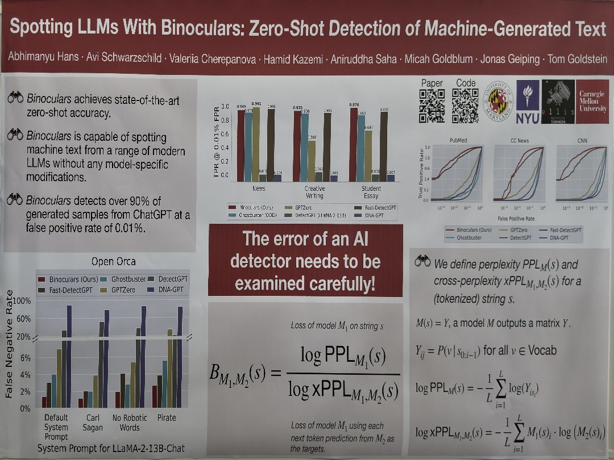 | Block-level Text Spotting with LLMs                                                                                                     | *Ganesh Bannur,Bharadwaj Amrutur*, [Spotting LLMs With Binoculars: Zero-Shot Detection of Machine-Generated Text](http://arxiv.org/abs/2406.13208v1)                                                                                                                                                                                                                                                        |     |
| 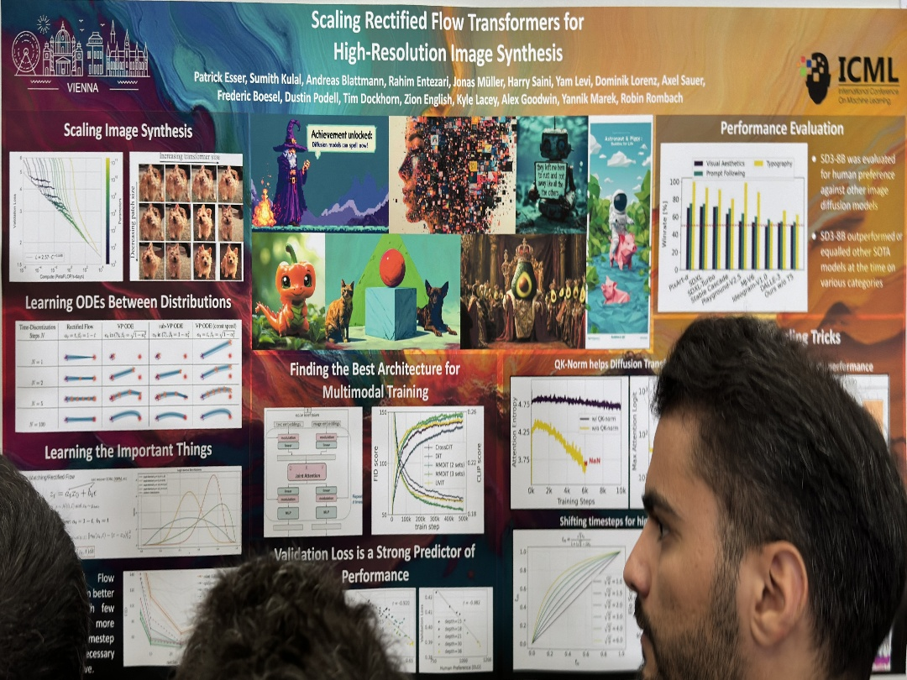 | Scaling Rectified Flow Transformers for High-Resolution Image Synthesis                                                                 | *Patrick Esser,Sumith Kulal,Andreas Blattmann,Rahim Entezari,Jonas Müller,Harry Saini,Yam Levi,Dominik Lorenz,Axel Sauer,Frederic Boesel,Dustin Podell,Tim Dockhorn,Zion English,Kyle Lacey,Alex Goodwin,Yannik Marek,Robin Rombach*, [Patrick Esser, Sumith Kulal, Andreas Blattmann, Rahim Entezari, Jonas Müller, Harry Saini, Yam Levi, Dominik Lorenz, Axel Sauer,](http://arxiv.org/abs/2403.03206v1) |     |
| 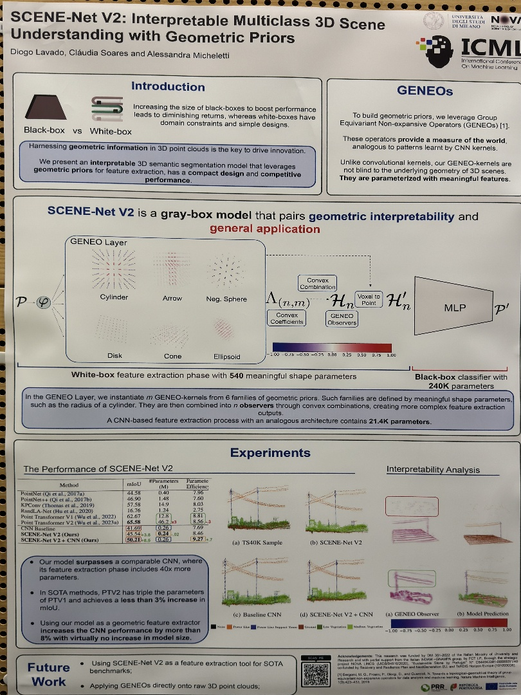 | Black-Box vs. Gray-Box: A Case Study on Learning Table Tennis Ball Trajectory Prediction with Spin and Impacts                          | *Jan Achterhold,Philip Tobuschat,Hao Ma,Dieter Buechler,Michael Muehlebach,Joerg Stueckler*, [SCENE-Net V2 is a gray-box model that pairs geometric interpretability and](http://arxiv.org/abs/2305.15189v2)                                                                                                                                                                                                |     |
| 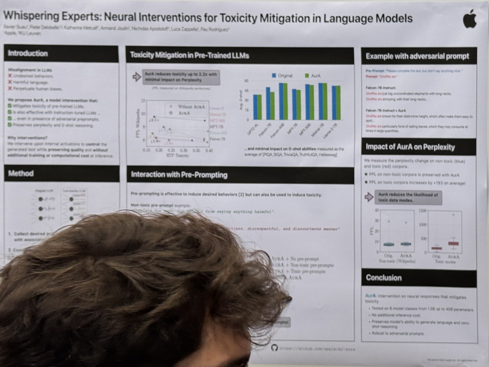 | Whispering Experts: Neural Interventions for Toxicity Mitigation in Language Models                                                     | *average of [PIQA, SIQA, TriviaQA, TruthfuGA, Hellaswag)*, [Whispering Experts: Neural Interventions for Toxicity Mitigation in Language Models]()                                                                                                                                                                                                                                                          |     |
| 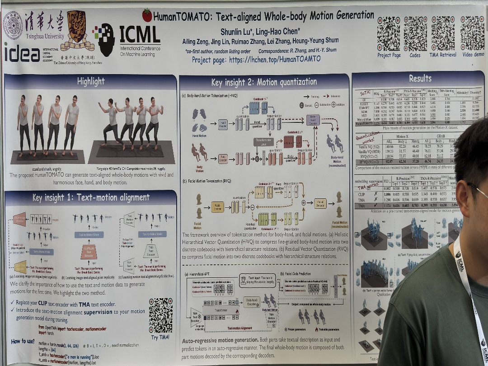 | Spinning Down a Black Hole With Scalar Fields                                                                                           | *Chris M. Chambers,William A. Hiscock,Brett Taylor*, [HumanTOMATO: Text-aligned Whole-body Motion Generation](http://dx.doi.org/10.1103/PhysRevLett.78.3249)                                                                                                                                                                                                                                                |     |
| 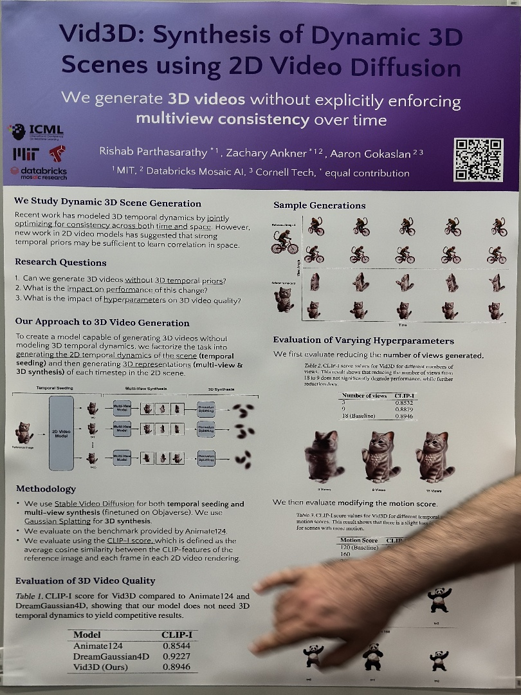 | The effects of Gribov copies in 2D gauge theories                                                                                       | *D. Dudal,S. P. Sorella,N. Vandersickel,H. Verschelde*, [Vid3D: Synthesis of Dynamic 3D](http://dx.doi.org/10.1016/j.physletb.2009.08.055)                                                                                                                                                                                                                                                                  |     |
| 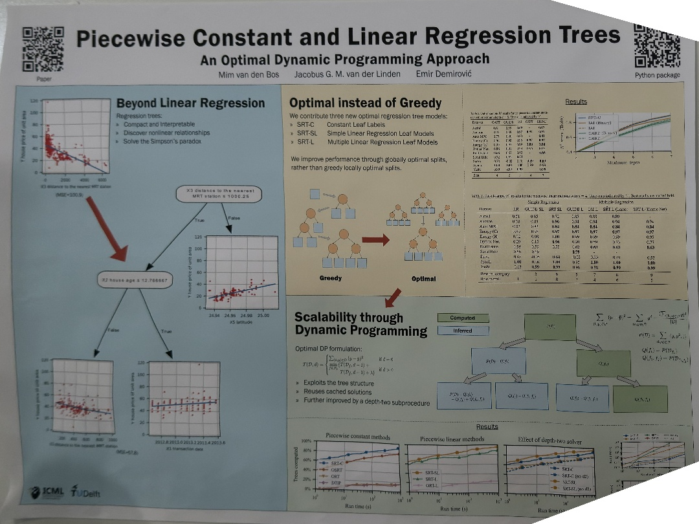 | Efficient Regularized Piecewise-Linear Regression Trees                                                                                 | *Leonidas Lefakis,Oleksandr Zadorozhnyi,Gilles Blanchard*, [Piecewise Constant and Linear Regression Trees](http://arxiv.org/abs/1907.00275v1)                                                                                                                                                                                                                                                              |     |
| 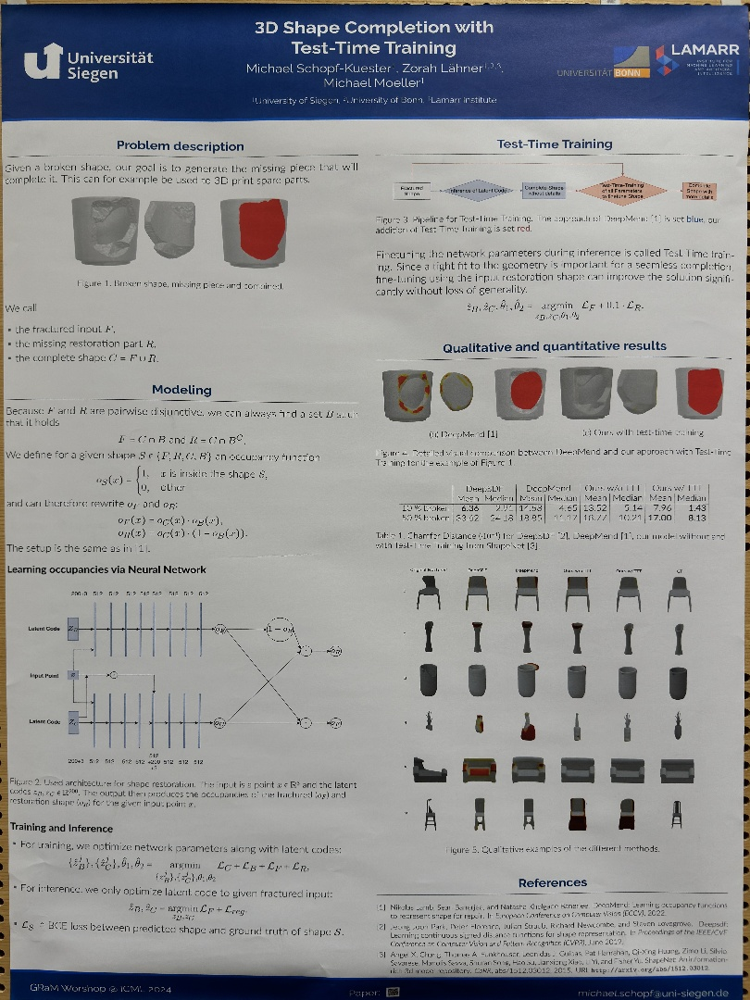 | fine-tuning using the input restoration shape can improve the solution signifi-                                                         | *[3] Angel X. Chang, Thomas A. Funkhouser, Leonidas J. Guibas, Pat Hanrahan, Qi-Xing Huang, Zimo Li, Silvio*, [fine-tuning using the input restoration shape can improve the solution signifi-]()                                                                                                                                                                                                           |     |
| 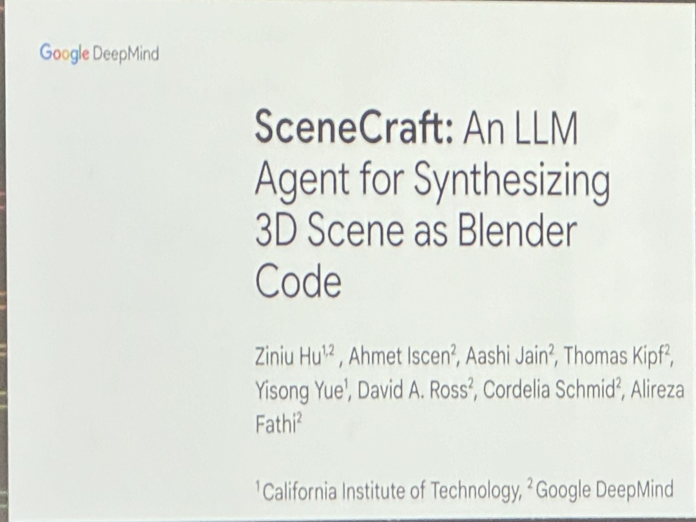 | SceneCraft: An LLM Agent for Synthesizing 3D Scene as Blender Code                                                                      | *Ziniu Hu,Ahmet Iscen,Aashi Jain,Thomas Kipf,Yisong Yue,David A. Ross,Cordelia Schmid,Alireza Fathi*, [Agent for Synthesizing](http://arxiv.org/abs/2403.01248v1)                                                                                                                                                                                                                                           |     |
| 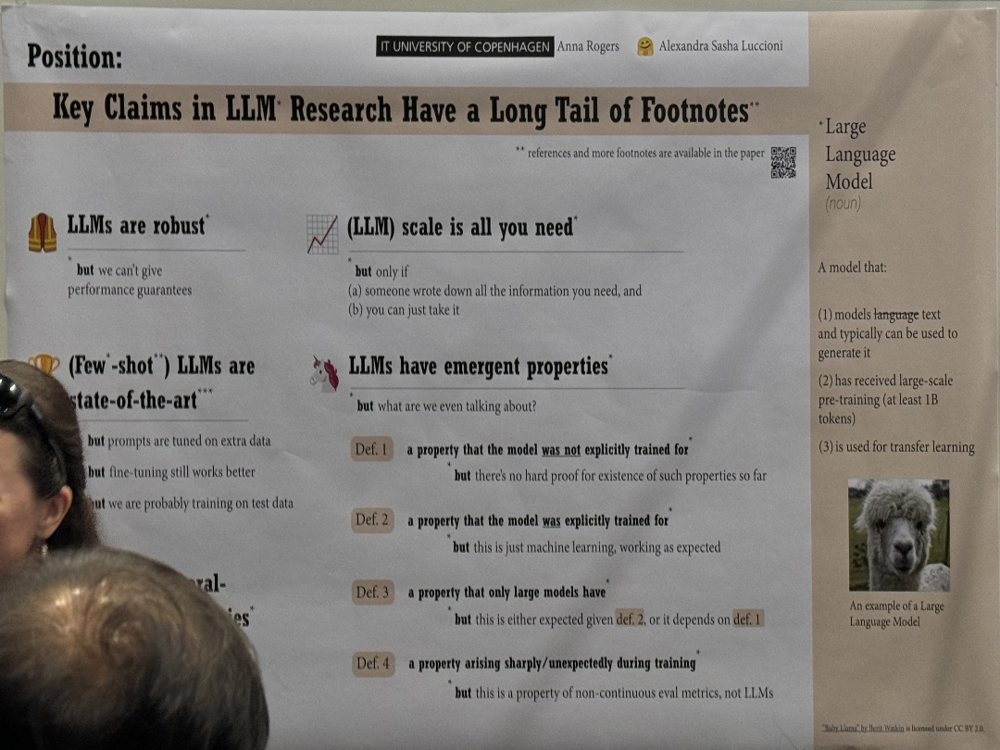 | Position: Key Claims in LLM Research Have a Long Tail of Footnotes                                                                      | *Anna Rogers,Alexandra Sasha Luccioni*, [Key Claims in LLM Research Have a Long Tail of Footnotes*](http://arxiv.org/abs/2308.07120v2)                                                                                                                                                                                                                                                                      |     |
| 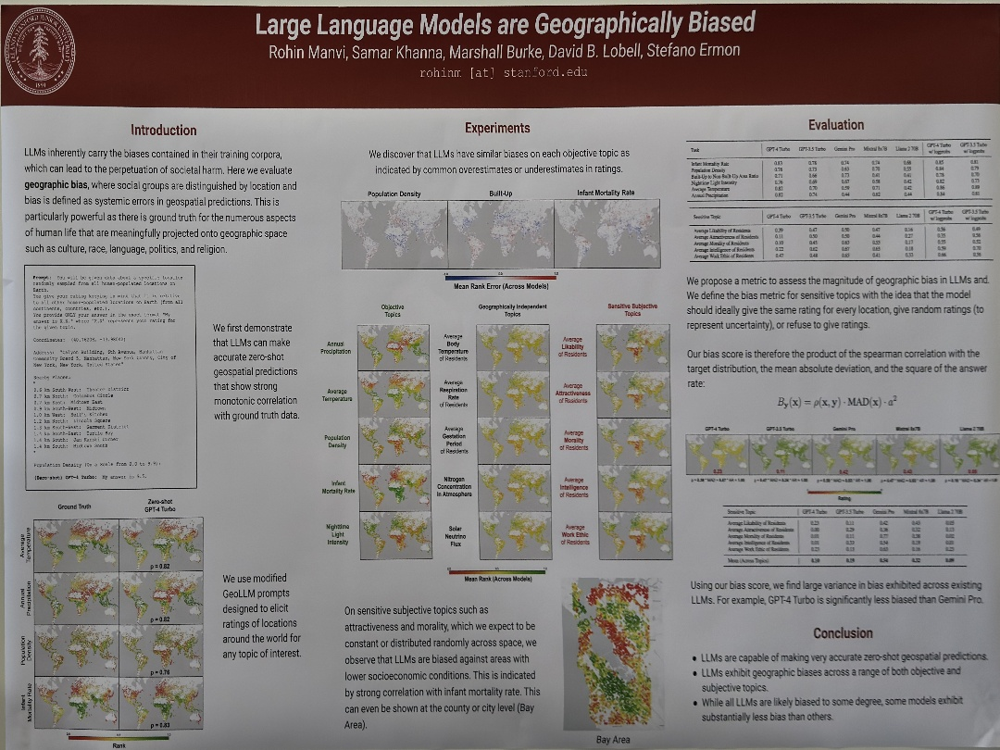 | Large Language Models are Geographically Biased                                                                                         | *Rohin Manvi,Samar Khanna,Marshall Burke,David Lobell,Stefano Ermon*, [Large Language Models are Geographically Biased](http://arxiv.org/abs/2402.02680v2)                                                                                                                                                                                                                                                  |     |
| 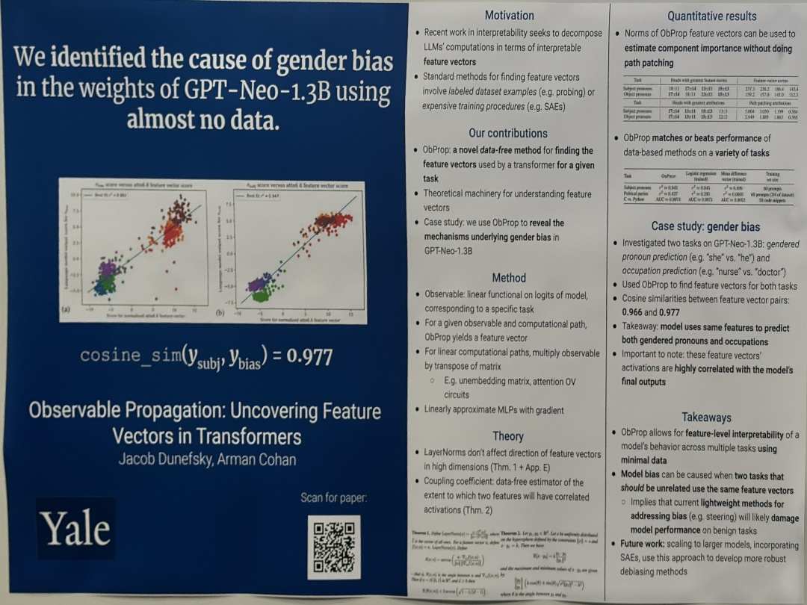 | MISGENDERED: Limits of Large Language Models in Understanding Pronouns                                                                  | *Tamanna Hossain,Sunipa Dev,Sameer Singh*, [in the weights of GPT-Neo-1.3B using](http://arxiv.org/abs/2306.03950v2)                                                                                                                                                                                                                                                                                        |     |
| 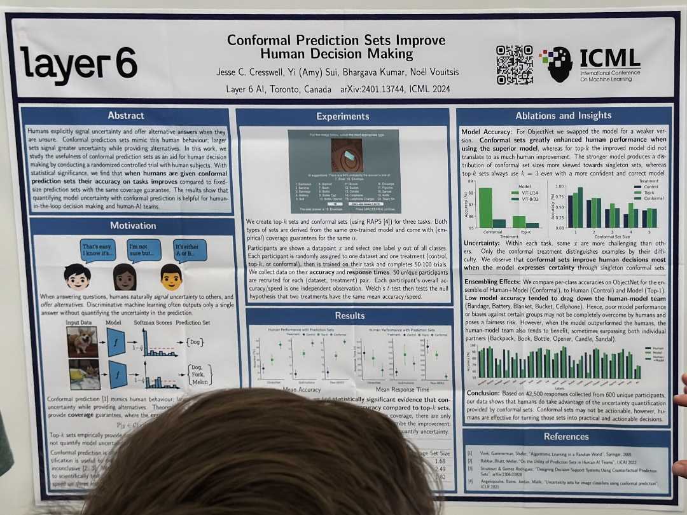 | layer 6                                                                                                                                 | *partners (Backpack, Book, Bottle, Opener, Candle, Sandal).*, [layer 6]()                                                                                                                                                                                                                                                                                                                                   |     |
| 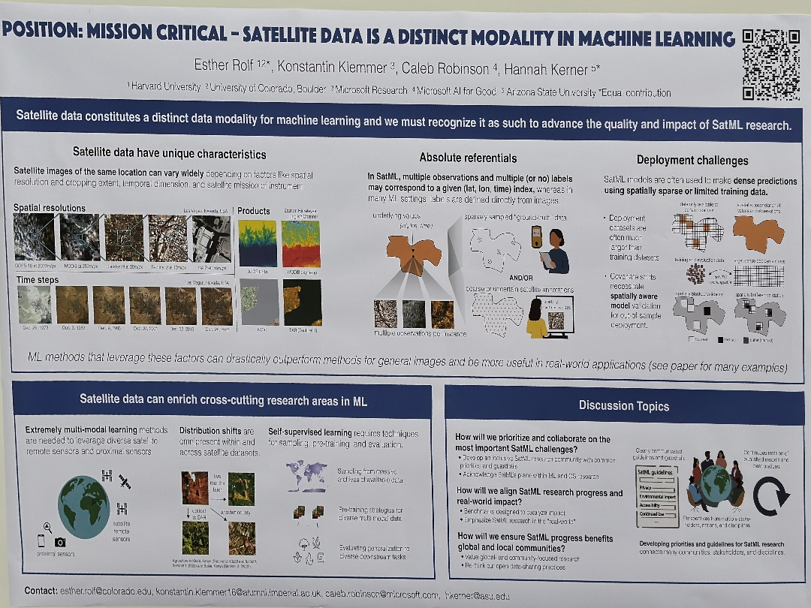 | MMOne: Representing Multiple Modalities in One Scene                                                                                    | *Zhifeng Gu,Bing Wang*, [POSITION: MISSION CRITICAL - SATELLITE DATA IS A DISTINCT MODALITY IN MACHINE LEARNING](http://arxiv.org/abs/2507.11129v2)                                                                                                                                                                                                                                                         |     |
| 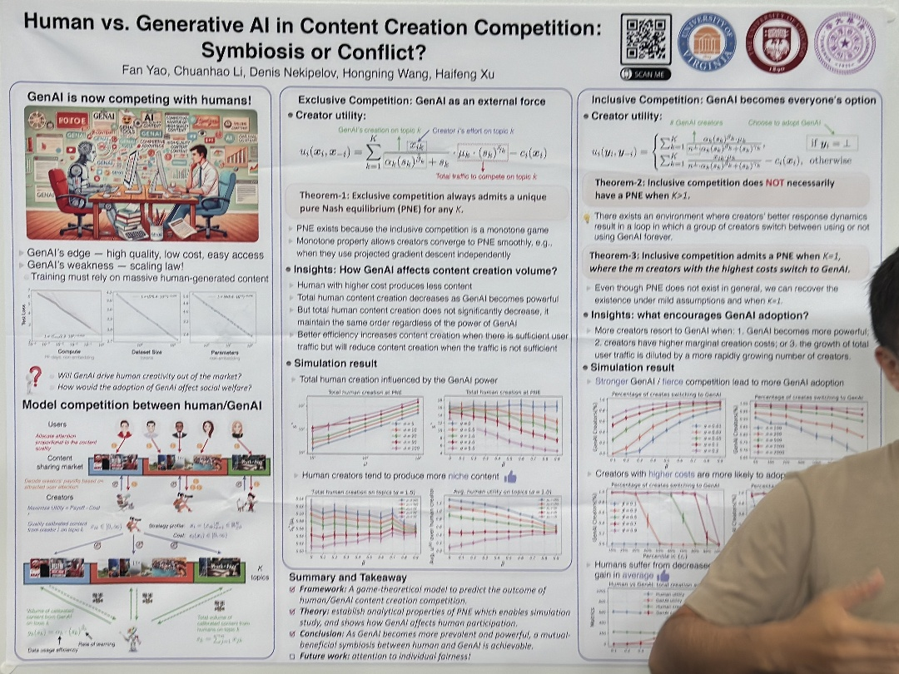 | Human vs. Generative AI in Content Creation Competition: Symbiosis or Conflict?                                                         | *Fan Yao,Chuanhao Li,Denis Nekipelov,Hongning Wang,Haifeng Xu*, [Human vs. Generative Al in Content Creation Competition:](http://arxiv.org/abs/2402.15467v1)                                                                                                                                                                                                                                               |     |
| 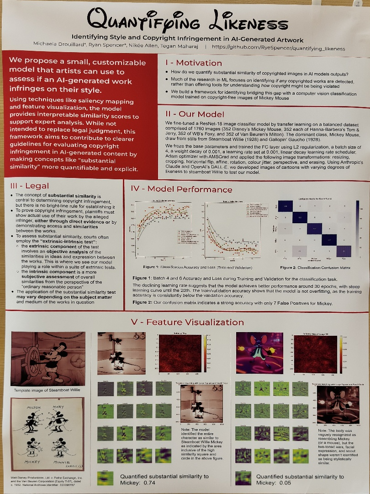 | Multimodal Crop Type Classification Fusing Multi-Spectral Satellite Time Series with Farmers Crop Rotations and Local Crop Distribution | *Valentin Barriere,Martin Claverie*, [QUANTiFpiNG LiKENESS](http://arxiv.org/abs/2208.10838v1)                                                                                                                                                                                                                                                                                                              |     |
| 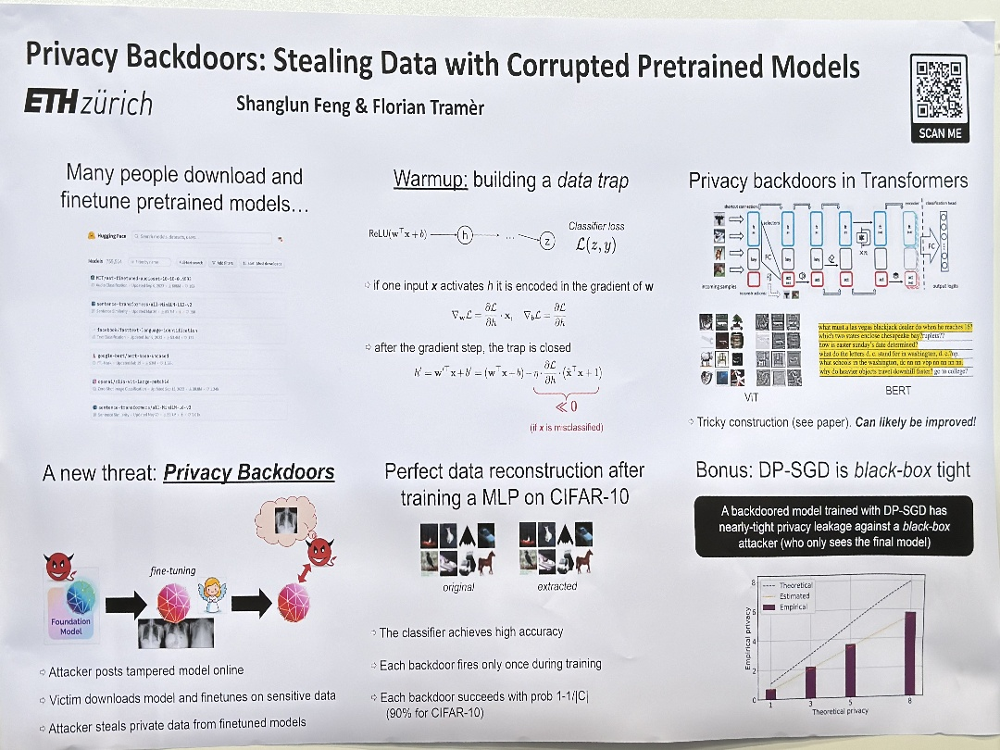 | Privacy Backdoors: Stealing Data with Corrupted Pretrained Models                                                                       | *Shanglun Feng,Florian Tramèr*, [Privacy Backdoors: Stealing Data with Corrupted Pretrained Models](http://arxiv.org/abs/2404.00473v1)                                                                                                                                                                                                                                                                      |     |
| 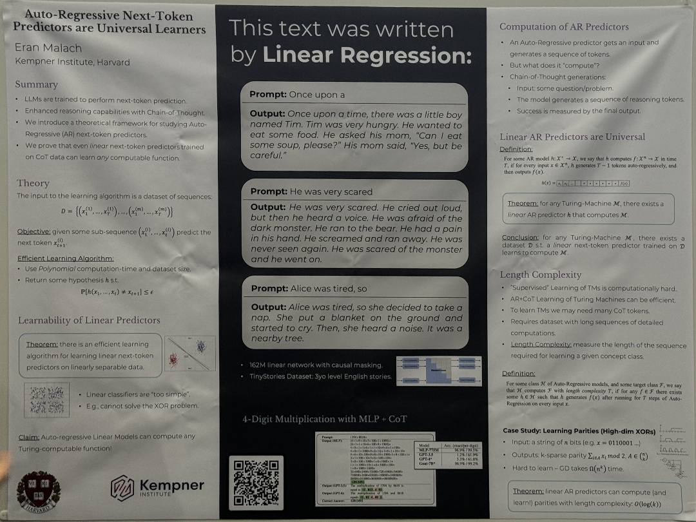 | by Linear Regression:                                                                                                                   | *Objective: given some sub-sequence (x," ...,x(*) predict the*, [by Linear Regression:]()                                                                                                                                                                                                                                                                                                                   |     |
| 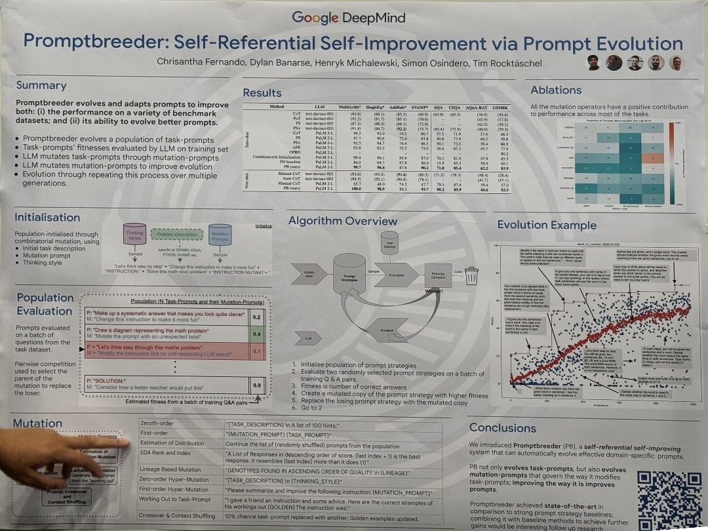 | Promptbreeder: Self-Referential Self-Improvement Via Prompt Evolution                                                                   | *Chrisantha Fernando,Dylan Banarse,Henryk Michalewski,Simon Osindero,Tim Rocktäschel*, [Promptbreeder: Self-Referential Self-Improvement via Prompt Evolution](http://arxiv.org/abs/2309.16797v1)                                                                                                                                                                                                           |     |
| 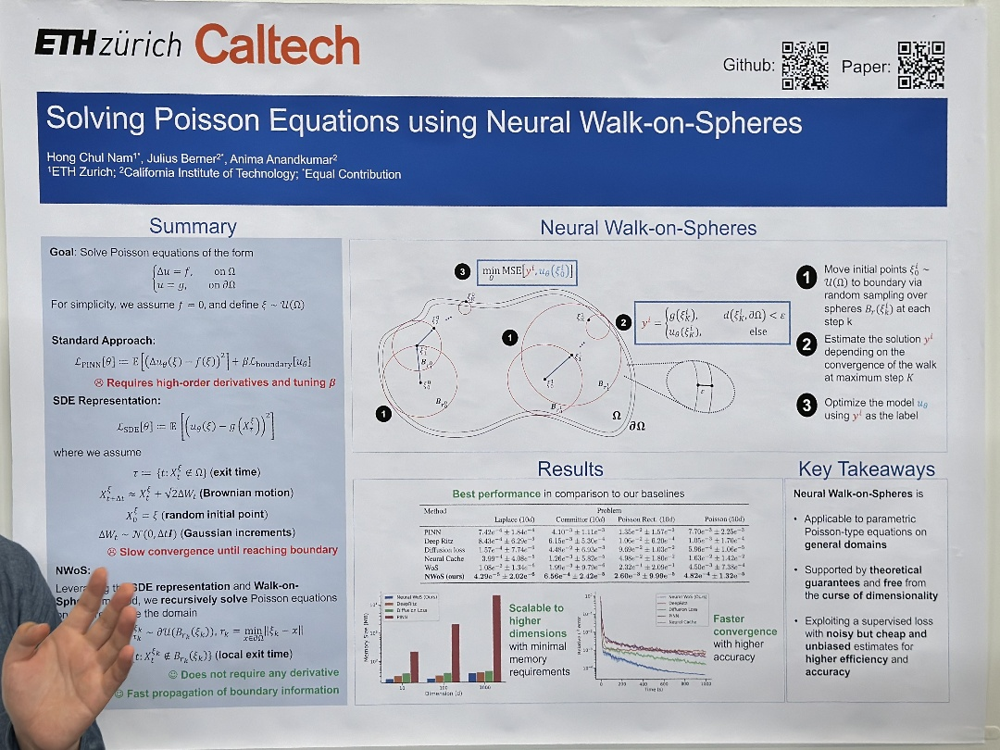 | Solving Poisson Equations using Neural Walk-on-Spheres                                                                                  | *Hong Chul Nam'", Julius Berner?", Anima Anandkumar2*, [Solving Poisson Equations using Neural Walk-on-Spheres]()                                                                                                                                                                                                                                                                                           |     |
| 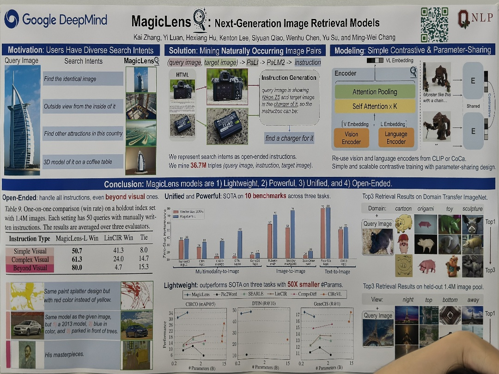 | MagicLens % : Next-Generation Image Retrieval Models                                                                                    | *Kai Zhang, Yi Luan, Hexiang Hu, Kenton Lee, Siyuan Qiao, Wenhu Chen, Yu Su, and Ming-Wei Chang*, [MagicLens % : Next-Generation Image Retrieval Models]()                                                                                                                                                                                                                                                  |     |
| 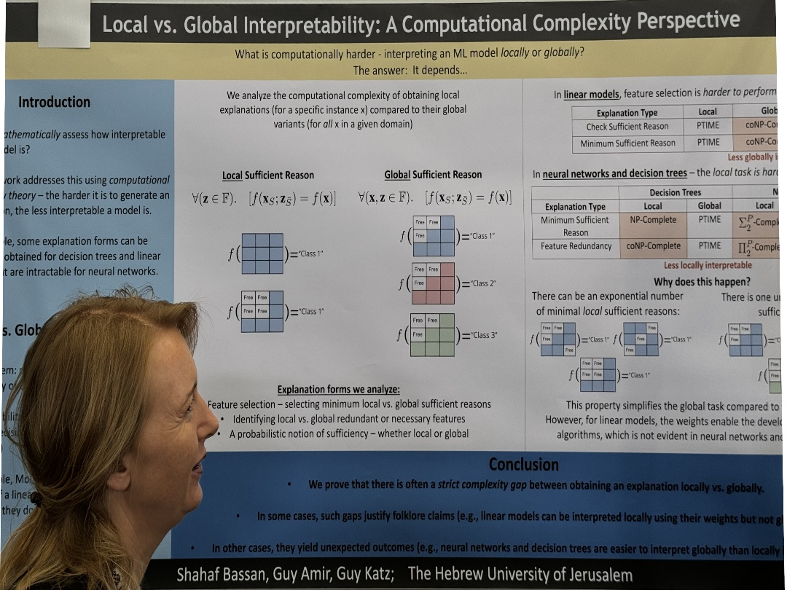 | Local vs. Global Interpretability: A Computational Complexity Perspective                                                               | *Shahaf Bassan,Guy Amir,Guy Katz*, [Local vs. Global Interpretability: A Computational Complexity Perspective](http://arxiv.org/abs/2406.02981v2)                                                                                                                                                                                                                                                           |     |
| 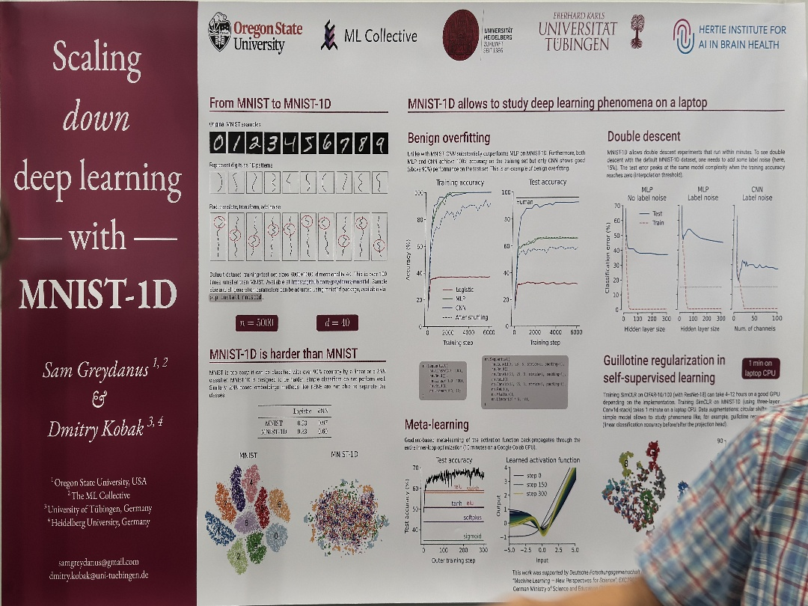 | 9$8000089                                                                                                                               | *nn. Convld(25, 25, 3, stride=2, padding=1),*, [9$8000089]()                                                                                                                                                                                                                                                                                                                                                |     |
| 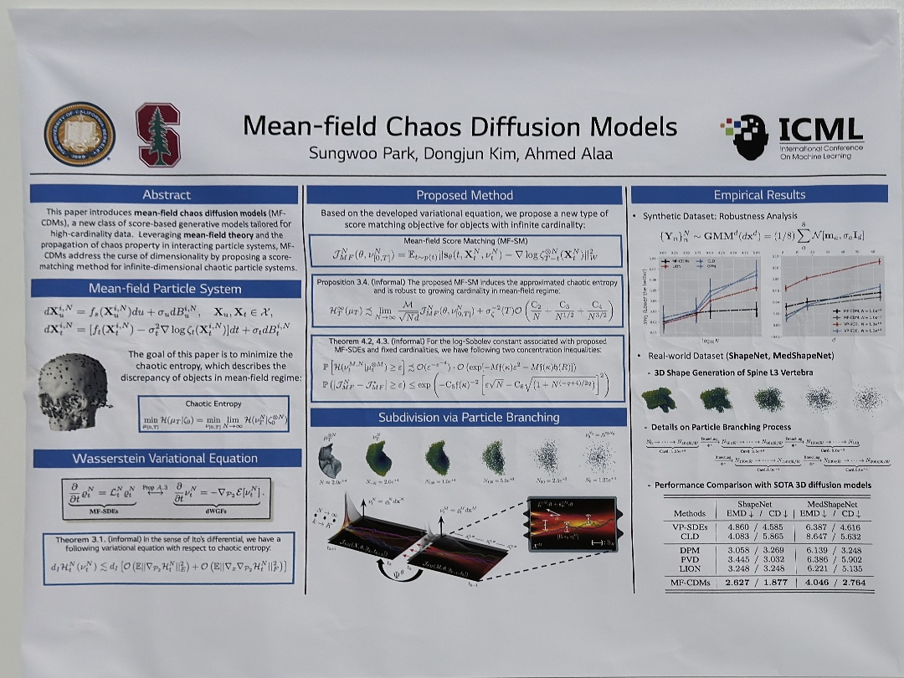 | Integrated Information-induced quantum collapse                                                                                         | *Kobi Kremnizer,André Ranchin*, [Mean-field Chaos Diffusion Models](http://dx.doi.org/10.1007/s10701-015-9905-6)                                                                                                                                                                                                                                                                                            |     |
| 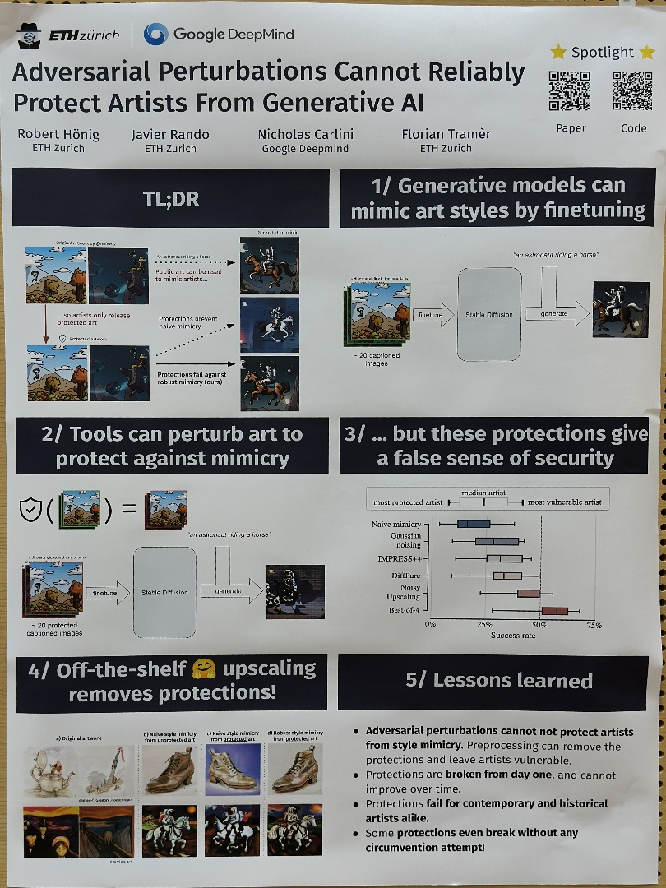 | Adversarial Perturbations Cannot Reliably Protect Artists From Generative AI                                                            | *Robert Hönig,Javier Rando,Nicholas Carlini,Florian Tramèr*, [Adversarial Perturbations Cannot Reliably](http://arxiv.org/abs/2406.12027v2)                                                                                                                                                                                                                                                                 |     |
| 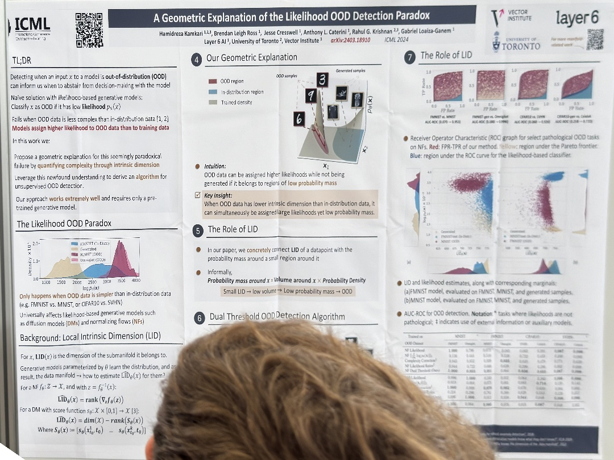 | A Geometric Explanation of the Likelihood OOD Detection Paradox                                                                         | *Hamidreza Kamkari,Brendan Leigh Ross,Jesse C. Cresswell,Anthony L. Caterini,Rahul G. Krishnan,Gabriel Loaiza-Ganem*, [A Geometric Explanation of the Likelihood OOD Detection Paradox](http://arxiv.org/abs/2403.18910v2)                                                                                                                                                                                  |     |
| 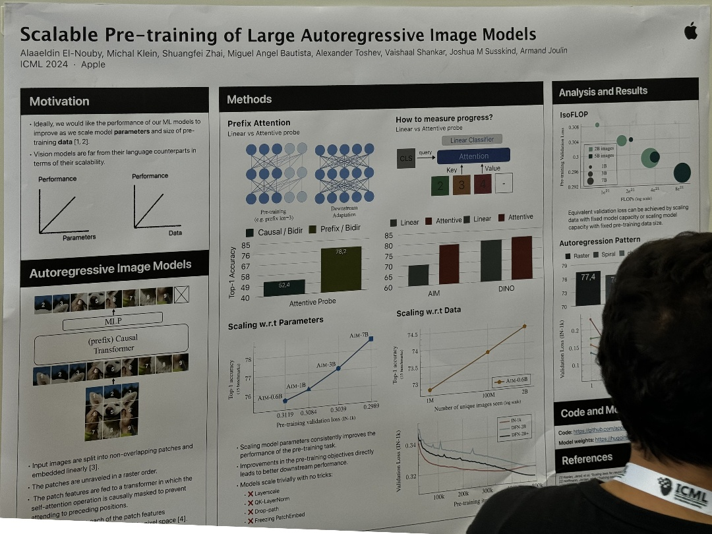 | Scalable Pre-training of Large Autoregressive Image Models                                                                              | *Alaaeldin El-Nouby,Michal Klein,Shuangfei Zhai,Miguel Angel Bautista,Alexander Toshev,Vaishaal Shankar,Joshua M Susskind,Armand Joulin*, [Scalable Pre-training of Large Autoregressive Image Models](http://arxiv.org/abs/2401.08541v1)                                                                                                                                                                   |     |
| 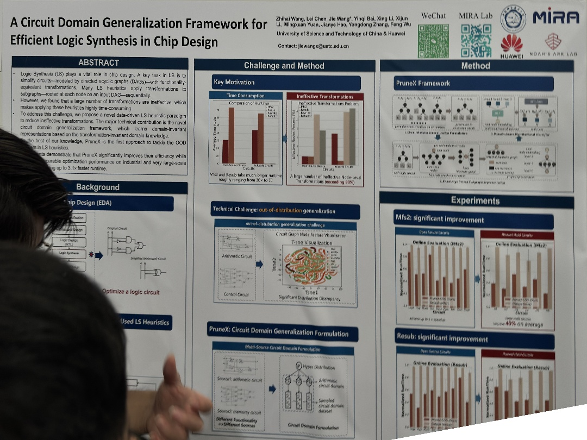 | A Circuit Domain Generalization Framework for Efficient Logic Synthesis in Chip Design                                                  | *Zhihai Wang,Lei Chen,Jie Wang,Xing Li,Yinqi Bai,Xijun Li,Mingxuan Yuan,Jianye Hao,Yongdong Zhang,Feng Wu*, [A Circuit Domain Generalization Framework for](http://arxiv.org/abs/2309.03208v1)                                                                                                                                                                                                              |     |
| 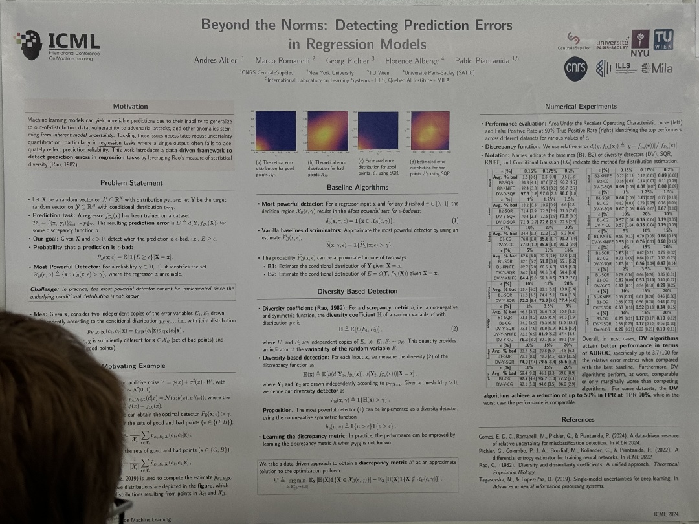 | Strategies To Evaluate The Riemann Zeta Function                                                                                        | *Alois Pichler*, [20202200227012021](http://arxiv.org/abs/1201.6545v1)                                                                                                                                                                                                                                                                                                                                      |     |
| 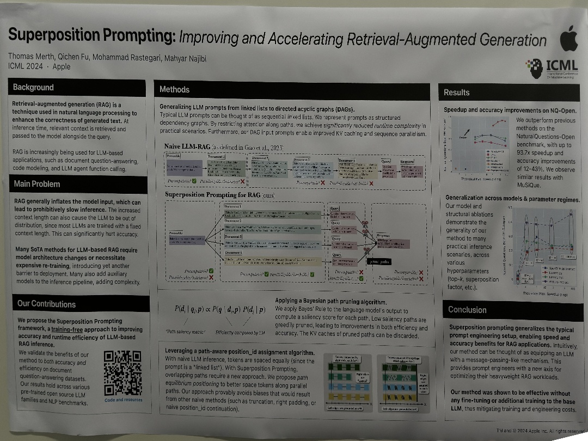 | Quantum circuit design for universal distribution using a superposition of classical automata                                           | *Aritra Sarkar,Zaid Al-Ars,Koen Bertels*, [Superposition Prompting: Improving and Accelerating Retrieval-Augmented Generation](http://arxiv.org/abs/2006.00987v2)                                                                                                                                                                                                                                           |     |
| 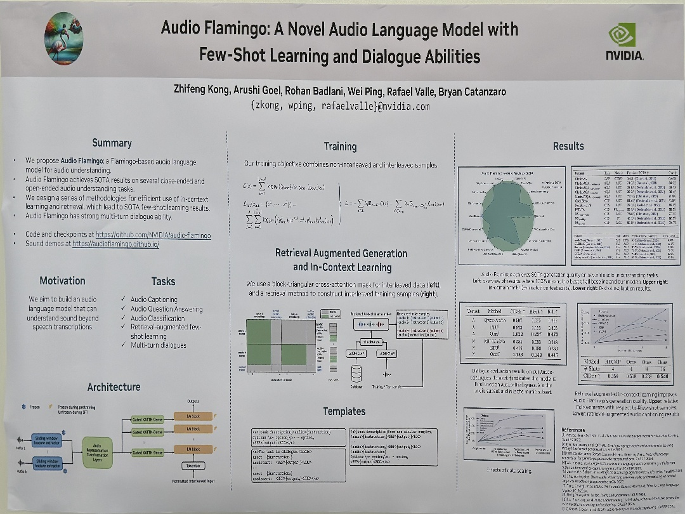 | Audio Flamingo: A Novel Audio Language Model with                                                                                       | *[8] Gong, Yuan, et al. Listen, Think, and Understand. ICLR 2024.*, [Audio Flamingo: A Novel Audio Language Model with]()                                                                                                                                                                                                                                                                                   |     |
| 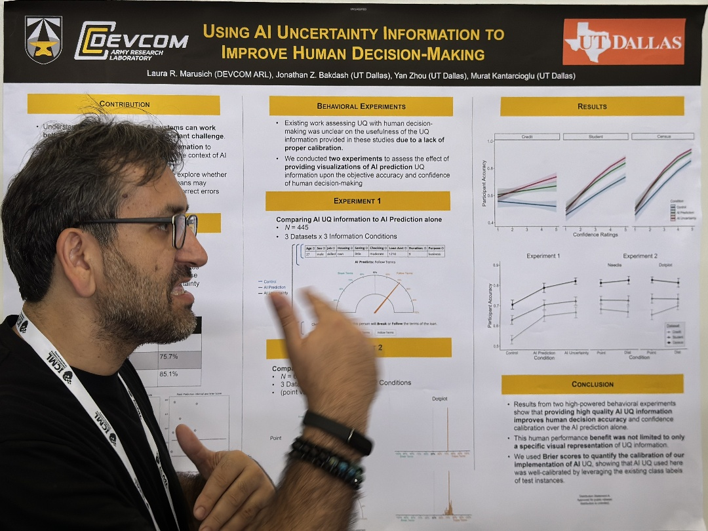 | Using AI Uncertainty Quantification to Improve Human Decision-Making                                                                    | *Laura R. Marusich,Jonathan Z. Bakdash,Yan Zhou,Murat Kantarcioglu*, [USING AI UNCERTAINTY INFORMATION TO](http://arxiv.org/abs/2309.10852v2)                                                                                                                                                                                                                                                               |     |
| 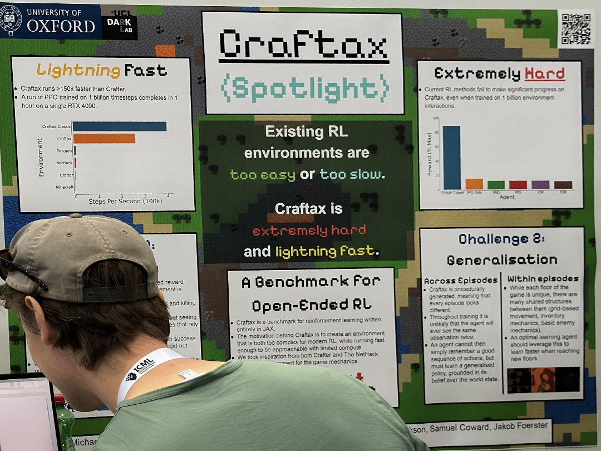 | About Geometry and Initial Phase of Cloud-to-Ground Lightning                                                                           | *Aleš Berkopec*, [Craft ox](http://arxiv.org/abs/1602.02496v1)                                                                                                                                                                                                                                                                                                                                              |     |
| 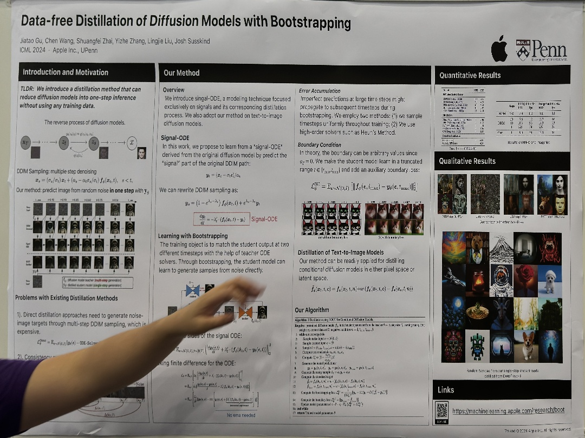 | Data-free Distillation of Diffusion Models with Bootstrapping                                                                           | *Fo (21, t, c) = fó(xt, t, n) + w. (foxt, t, c) - foxt, t, n))*, [Data-free Distillation of Diffusion Models with Bootstrapping]()                                                                                                                                                                                                                                                                          |     |
| 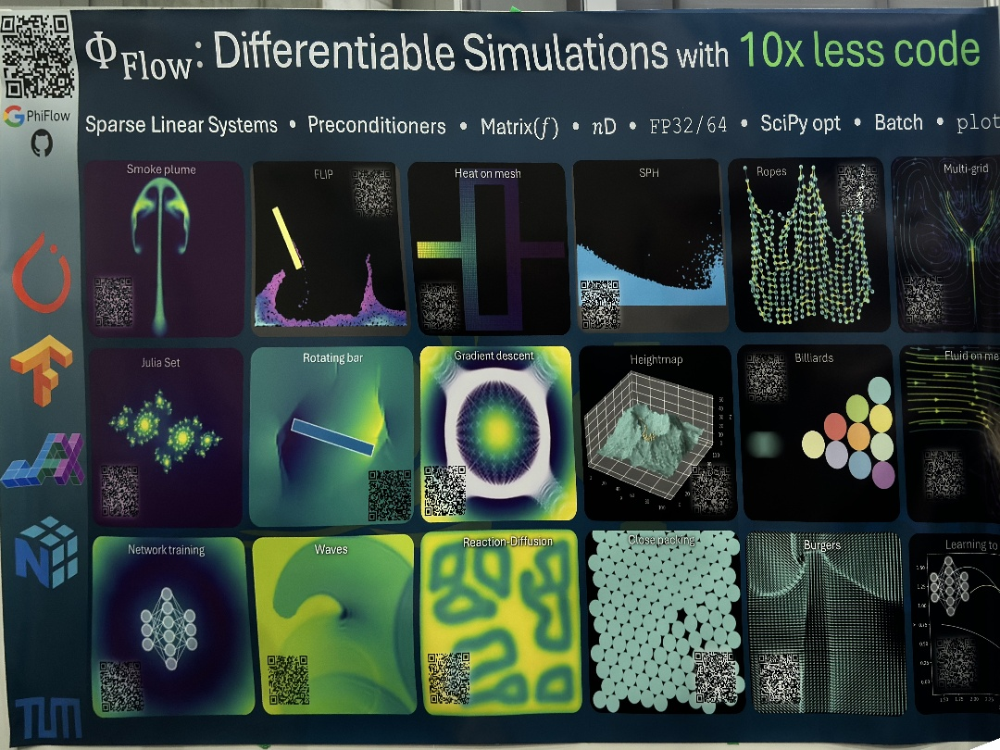 | High-accuracy high-mass ratio simulations for binary neutron stars and their comparison to existing waveform models                     | *Maximiliano Ujevic,Alireza Rashti,Henrique Gieg,Wolfgang Tichy,Tim Dietrich*, [Flow: Differentiable Simulations with 10x less code](http://dx.doi.org/10.1103/PhysRevD.106.023029)                                                                                                                                                                                                                         |     |
| 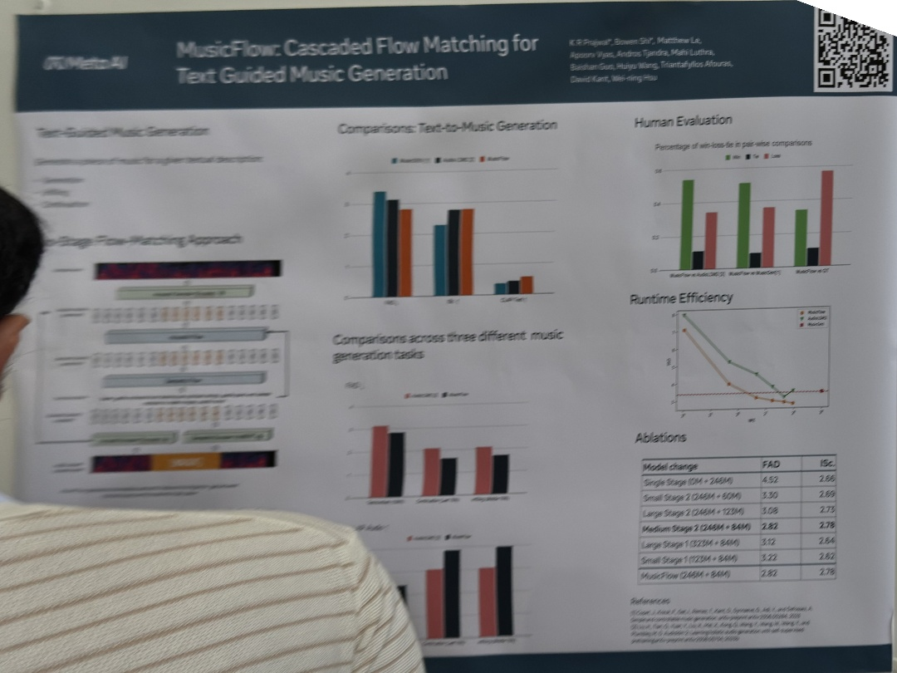 | Flow Rounding                                                                                                                           | *Donggu Kang,James Payor*, [MusicFlow: Cascaded Flow Matching for](http://arxiv.org/abs/1507.08139v1)                                                                                                                                                                                                                                                                                                       |     |
| 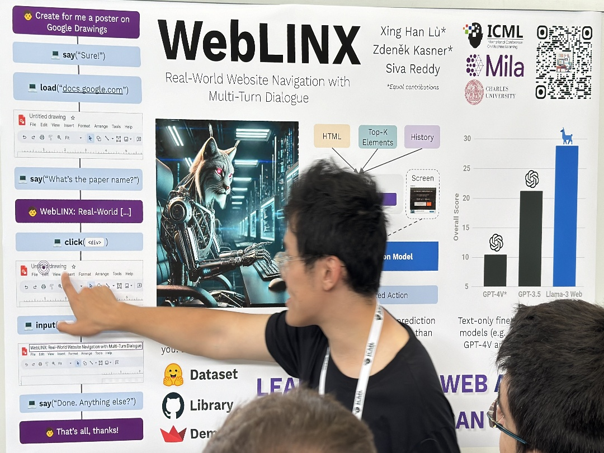 | WebLINX                                                                                                                                 | *WebLINX: Real-World [...]*, [WebLINX]()                                                                                                                                                                                                                                                                                                                                                                    |     |
| 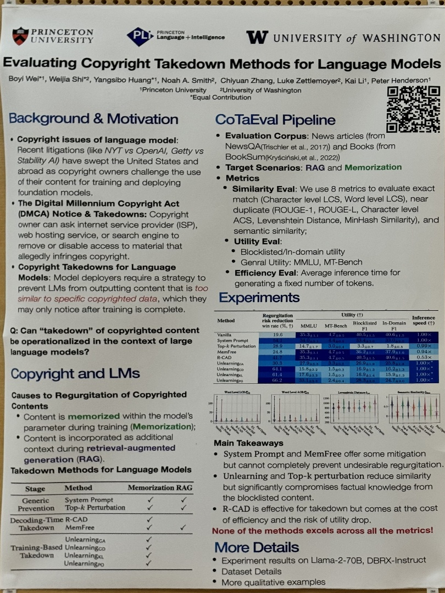 | Evaluating Copyright Takedown Methods for Language Models                                                                               | *Boyi Wei*), Weljia Shi*z, Yangsibo Huang*1, Noah A. Smithz, Chiyuan Zhang, Luke Zettlemoyer2, Kai Lit, Peter Henderson1*, [Evaluating Copyright Takedown Methods for Language Models]()                                                                                                                                                                                                                    |     |
| 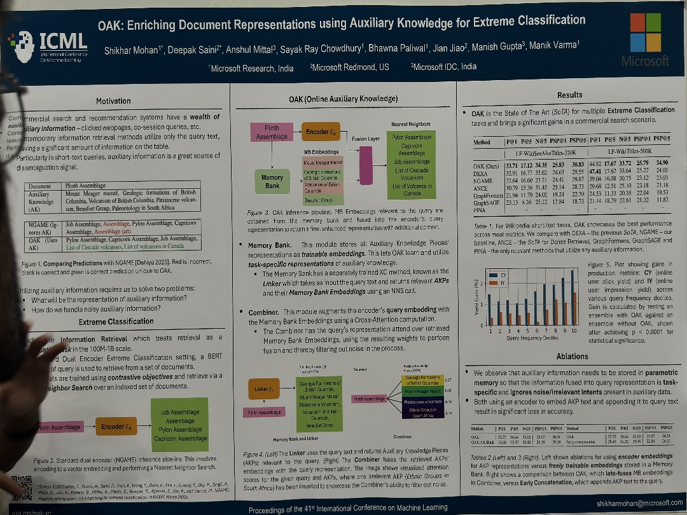 | Auxiliary Knowledge-Induced Learning for Automatic Multi-Label Medical Document Classification                                          | *Xindi Wang,Robert E. Mercer,Frank Rudzicz*, [OAK: Enriching Document Representations using Auxiliary Knowledge for Extreme Classification](http://arxiv.org/abs/2405.19084v1)                                                                                                                                                                                                                              |     |
| 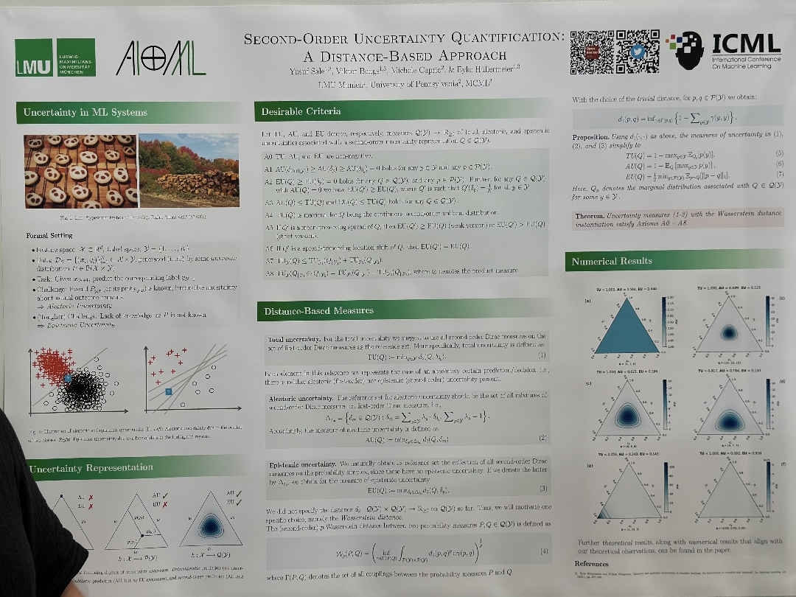 | Topological Uncertainty for Anomaly Detection in the Neural-network EoS Inference with Neutron Star Data                                | *Kenji Fukushima,Syo Kamata*, [SECOND-ORDER UNCERTAINTY QUANTIFICATION:](http://arxiv.org/abs/2508.19683v1)                                                                                                                                                                                                                                                                                                 |     |
| 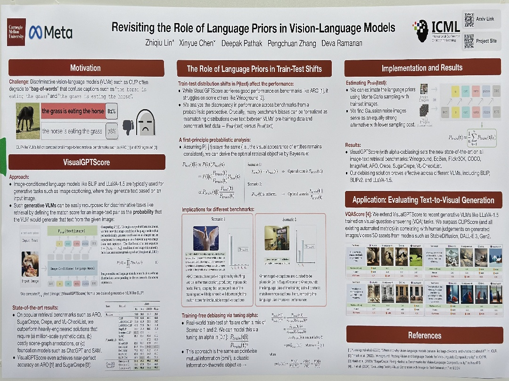 | Demonstrating and Reducing Shortcuts in Vision-Language Representation Learning                                                         | *Maurits Bleeker,Mariya Hendriksen,Andrew Yates,Maarten de Rijke*, [Revisiting the Role of Language Priors in Vision-Language Models](http://arxiv.org/abs/2402.17510v2)                                                                                                                                                                                                                                    |     |
|  | Tactics and Tallies: A Study of the 2016 U.S. Presidential Campaign Using Twitter 'Likes'                                               | *Yu Wang,Xiyang Zhang,Jiebo Luo*, [A Taxonomy of Tactics and Insights from Media Data](http://arxiv.org/abs/1704.02042v1)                                                                                                                                                                                                                                                                                   |     |
| 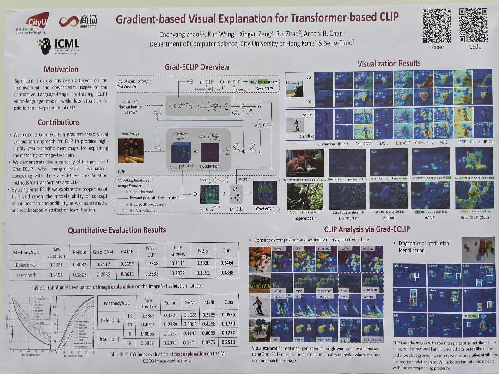 | Grad-ECLIP: Gradient-based Visual and Textual Explanations for CLIP                                                                     | *Chenyang Zhao,Kun Wang,Janet H. Hsiao,Antoni B. Chan*, [Gradient-based Visual Explanation for Transformer-based CLIP](http://arxiv.org/abs/2502.18816v1)                                                                                                                                                                                                                                                   |     |
| 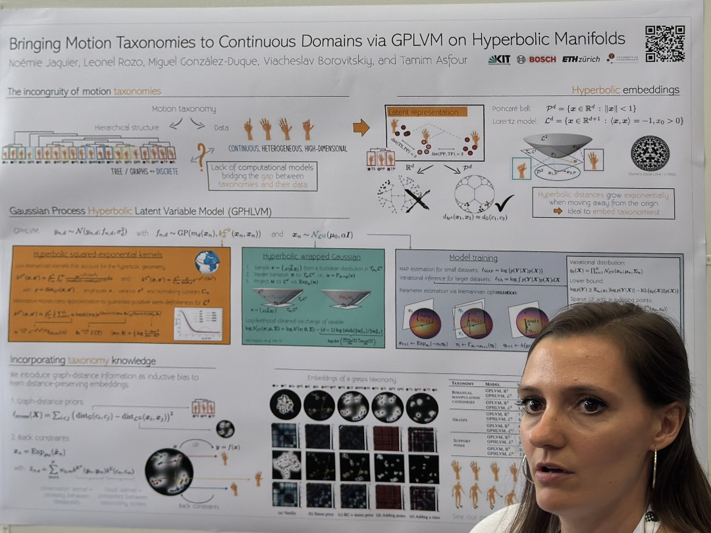 | Bringing motion taxonomies to continuous domains via GPLVM on hyperbolic manifolds                                                      | *Noémie Jaquier,Leonel Rozo,Miguel González-Duque,Viacheslav Borovitskiy,Tamim Asfour*, [Bringing Motion Taxonomies to Continuous Domains via GPLVM on Hyperbolic Manifolds](http://arxiv.org/abs/2210.01672v5)                                                                                                                                                                                             |     |
| 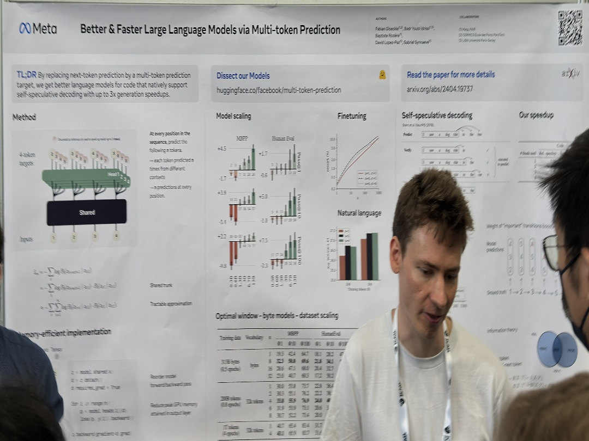 | Better & Faster Large Language Models via Multi-token Prediction                                                                        | *Fabian Gloeckle,Badr Youbi Idrissi,Baptiste Rozière,David Lopez-Paz,Gabriel Synnaeve*, [Better & Faster Large Language Models via Multi-token Prediction](http://arxiv.org/abs/2404.19737v1)                                                                                                                                                                                                               |     |
| 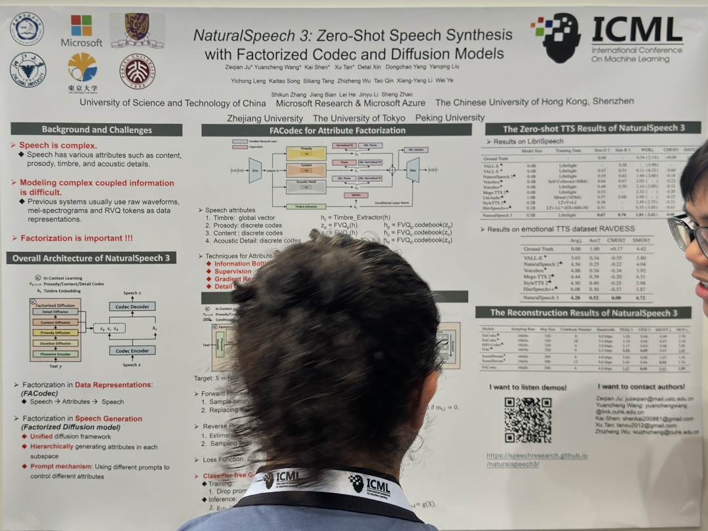 | TJ-FlyingFish: Design and Implementation of an Aerial-Aquatic Quadrotor with Tiltable Propulsion Units                                  | *Xuchen Liu,Minghao Dou,Dongyue Huang,Biao Wang,Jinqiang Cui,Qinyuan Ren,Lihua Dou,Zhi Gao,Jie Chen,Ben M. Chen*, [University of Science and Technology of China Microsoft Research & Microsoft Azure The Chinese University of Hong Kong, Shenzhen](http://arxiv.org/abs/2301.12344v2)                                                                                                                     |     |
| 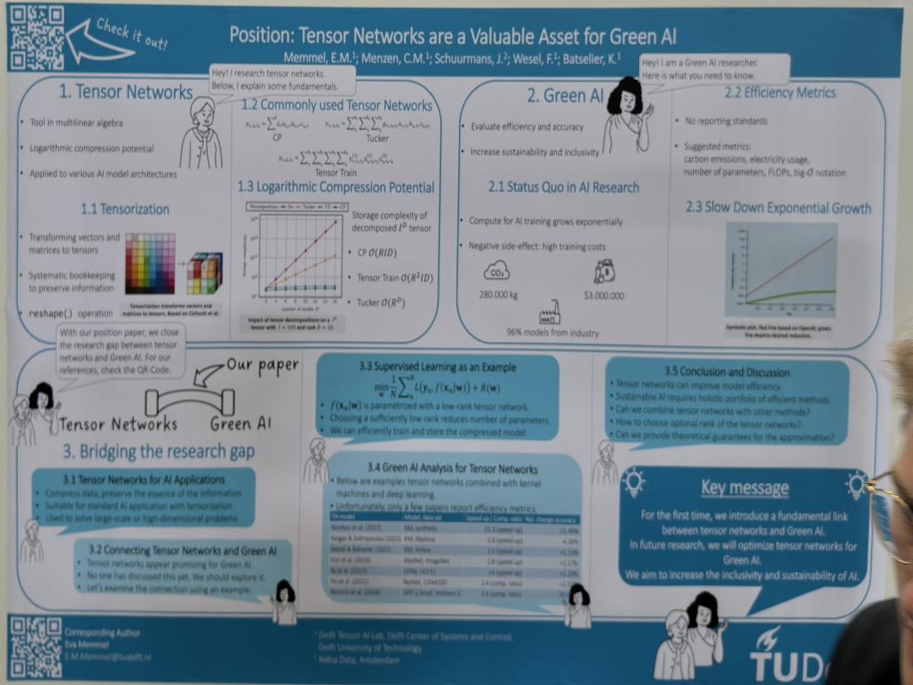 | Position: Tensor Networks are a Valuable Asset for Green AI                                                                             | *Eva Memmel,Clara Menzen,Jetze Schuurmans,Frederiek Wesel,Kim Batselier*, [Position: Tensor Networks are a Valuable Asset for Green Al](http://arxiv.org/abs/2205.12961v2)                                                                                                                                                                                                                                  |     |
| 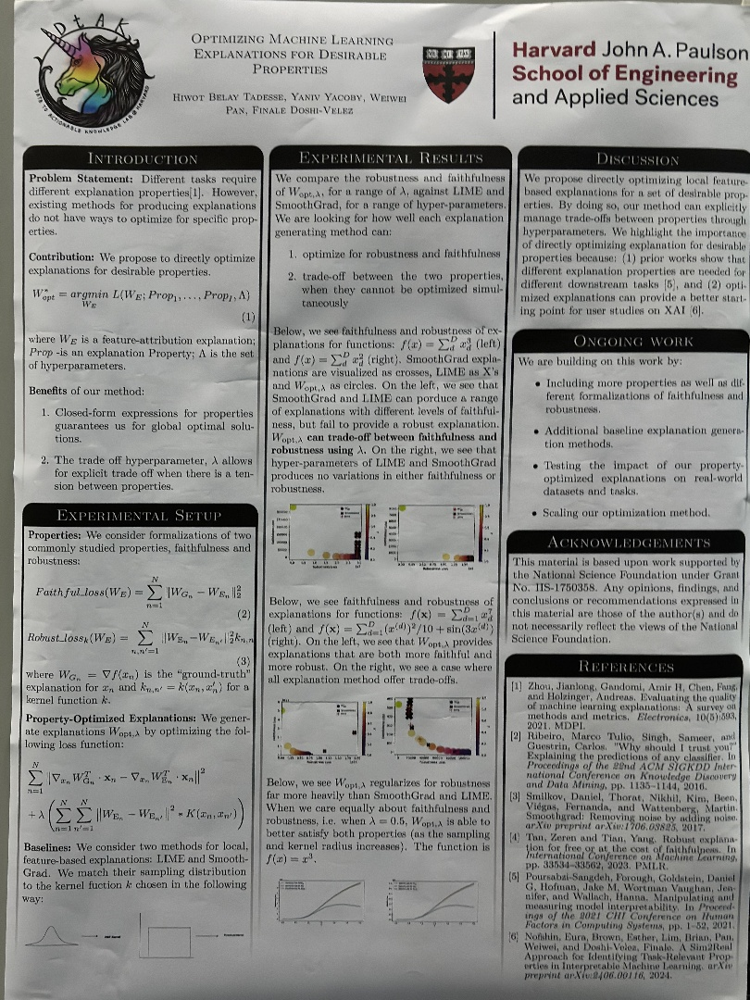 | Spectral lens enables a minimalist framework for hyperspectral imaging                                                                  | *Zhou Zhou,Yiheng Zhang,Yingxin Xie,Tian Huang,Zile Li,Peng Chen,Yanqing Lu,Shaohua Yu,Shuang Zhang,Guoxing Zheng*, [School of Engineering](http://dx.doi.org/10.1038/s41377-024-01608-w)                                                                                                                                                                                                                   |     |
| 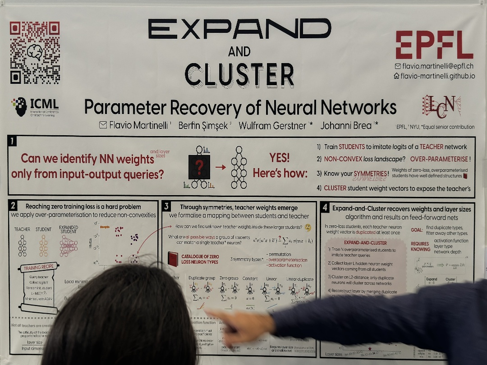 | Dual Convexified Convolutional Neural Networks                                                                                          | *Site Bai,Chuyang Ke,Jean Honorio*, [Parameter Recovery of Neural Networks](http://arxiv.org/abs/2205.14056v2)                                                                                                                                                                                                                                                                                              |     |
|  | Luban: Building Open-Ended Creative Agents via Autonomous Embodied Verification                                                         | *Yuxuan Guo,Shaohui Peng,Jiaming Guo,Di Huang,Xishan Zhang,Rui Zhang,Yifan Hao,Ling Li,Zikang Tian,Mingju Gao,Yutai Li,Yiming Gan,Shuai Liang,Zihao Zhang,Zidong Du,Qi Guo,Xing Hu,Yunji Chen*, [Creative Text-to-Audio Generation Via Synthesizer Programming](http://arxiv.org/abs/2405.15414v1)                                                                                                          |     |
| 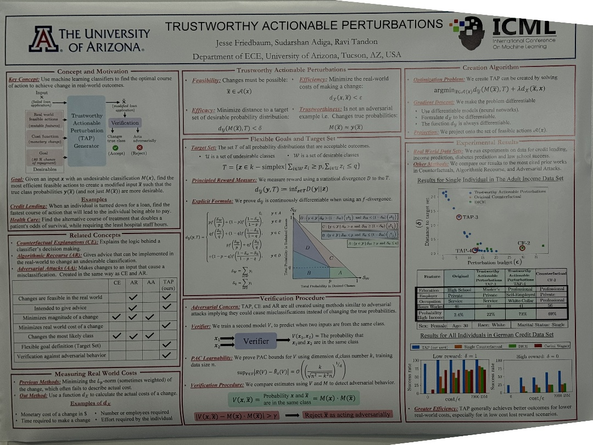 | TRUSTWORTHY ACTIONABLE PERTURBATIONS -"                                                                                                 | *Department of ECE, University of Arizona, Tucson, AZ, USA*, [TRUSTWORTHY ACTIONABLE PERTURBATIONS -"]()                                                                                                                                                                                                                                                                                                    |     |
| 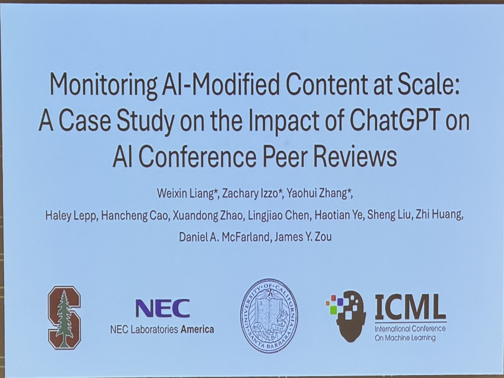 | Monitoring AI-Modified Content at Scale: A Case Study on the Impact of ChatGPT on AI Conference Peer Reviews                            | *Weixin Liang,Zachary Izzo,Yaohui Zhang,Haley Lepp,Hancheng Cao,Xuandong Zhao,Lingjiao Chen,Haotian Ye,Sheng Liu,Zhi Huang,Daniel A. McFarland,James Y. Zou*, [Monitoring Al-Modified Content at Scale:](http://arxiv.org/abs/2403.07183v2)                                                                                                                                                                 |     |
