| **Poster** | **Title** | **Information** | 
| -- | -- | -- | 
| 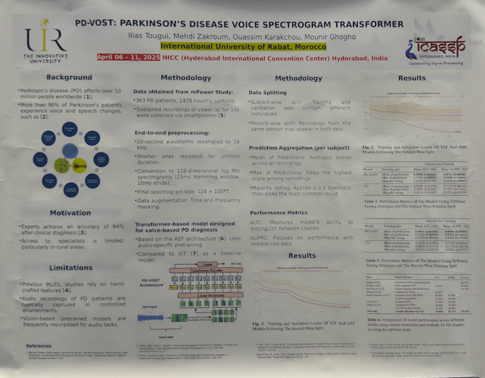 | PD-VOST: Parkinson's Disease Voice Spectrogram Transformer | *llias Tougui, Mehdi Zakroum, Ouassim Karakchou, Mounir Ghogho*, [PD{-}VOST: Parkinson's Disease Voice Spectrogram Transformer](https://ieeexplore.ieee.org/abstract/document/10889820/) | 
| 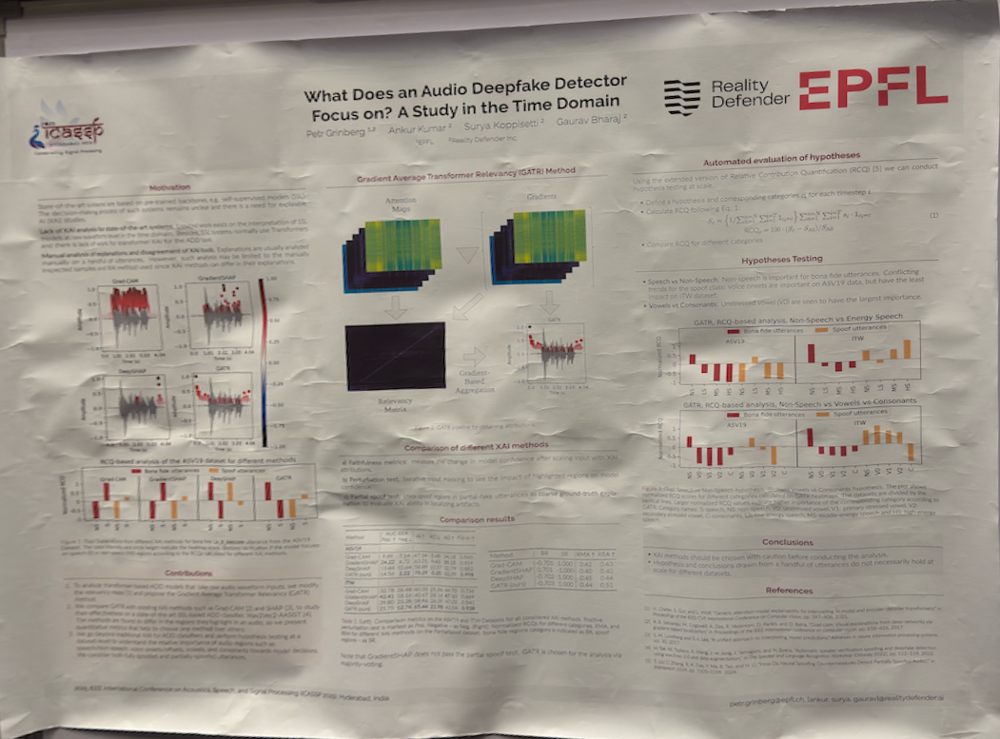 | The EPFL combinational benchmark suite | *pee/ginbergaepf.ch, facia, surya, gauravia roatty defender al*, [The EPFL combinational benchmark suite](https://si2.epfl.ch/demichel/publications/archive/2015/IWLS15.pdf) | 
| 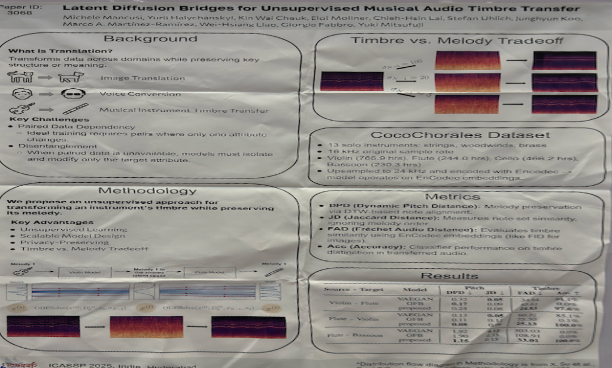 | Latent diffusion bridges for unsupervised musical audio timbre transfer | *Michele Mancusi, Yurii Halychanskyi, Kin Wai Cheuk, Eloi Moliner, Chieh{-}Hsin Lai, Stefan Uhlich, Junghyun Koo.*, [Latent diffusion bridges for unsupervised musical audio timbre transfer](https://ieeexplore.ieee.org/abstract/document/10890708/) | 
| 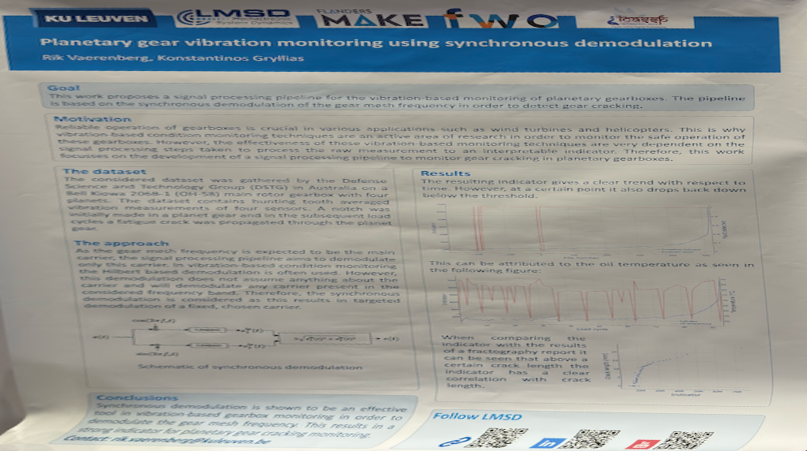 | do a crow endus ported ten band mentorine at pear enoses. The pipeline | *do a crow endus ported ten band mentorine at pear enoses. The pipeline*, [do a crow endus ported ten band mentorine at pear enoses. The pipeline]() | 
| 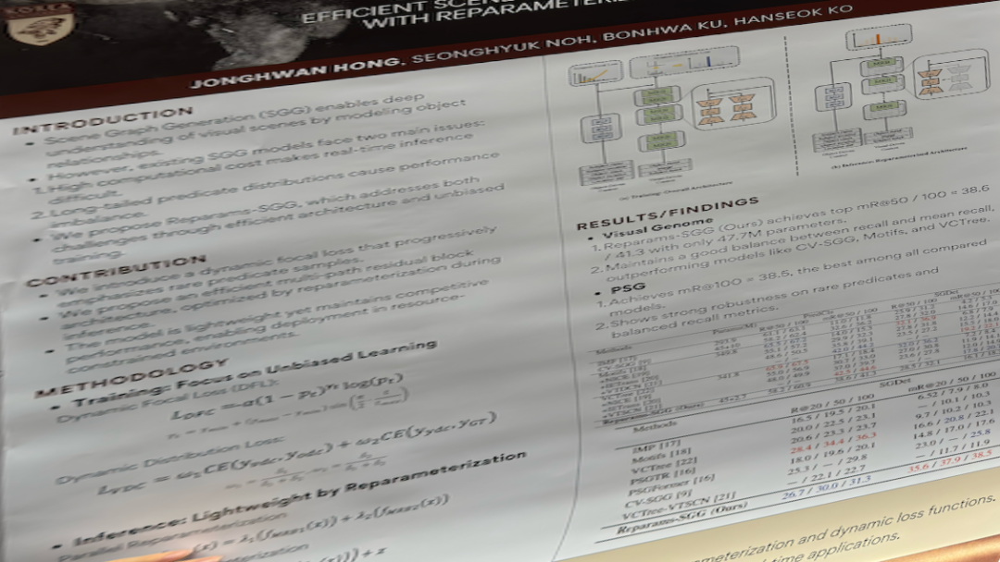 | EFFICETH REPARAMNE | *outperforming models like CV{-}SOG, Motifs, and VCTree.*, [EFFICETH REPARAMNE]() | 
| 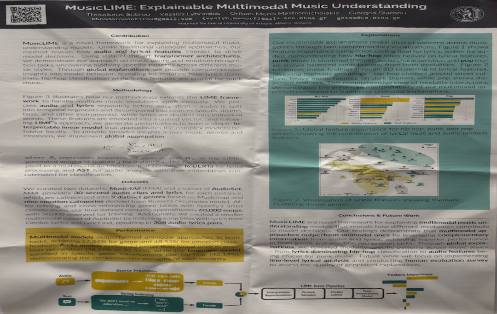 | Musiclime: Explainable multimodal music understanding | *tasks, achieving 57.34\% for genre and 48.53\% for emotion Classi{-}*, [Musiclime: Explainable multimodal music understanding](https://ieeexplore.ieee.org/abstract/document/10889771/) | 
| 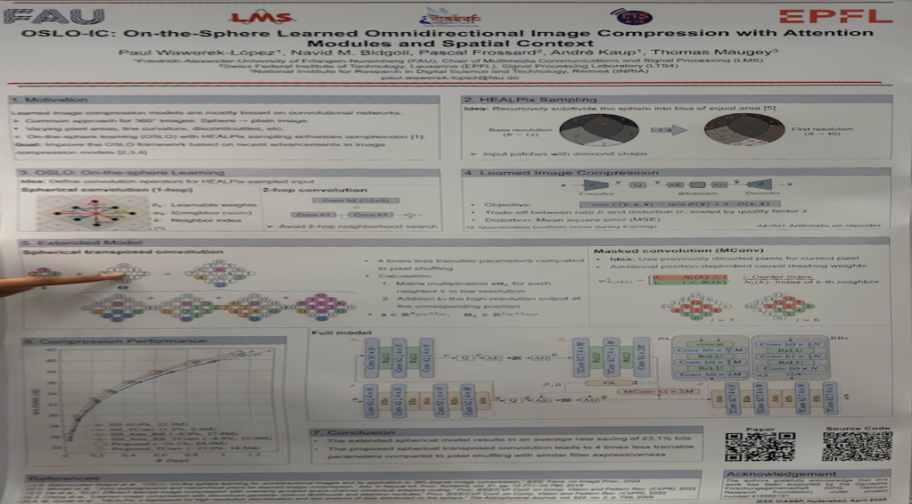 | OSLO-IC: On-the-Sphere Learned Omnidirectional Image Compression with Attention Modules and Spatial Context | *Bidgoll, Pascal Frossard?, André Kaup", Thomas Maugey?*, [OSLO{-}IC: On{-}the{-}Sphere Learned Omnidirectional Image Compression with Attention Modules and Spatial Context](https://ieeexplore.ieee.org/abstract/document/10889131/) | 
| 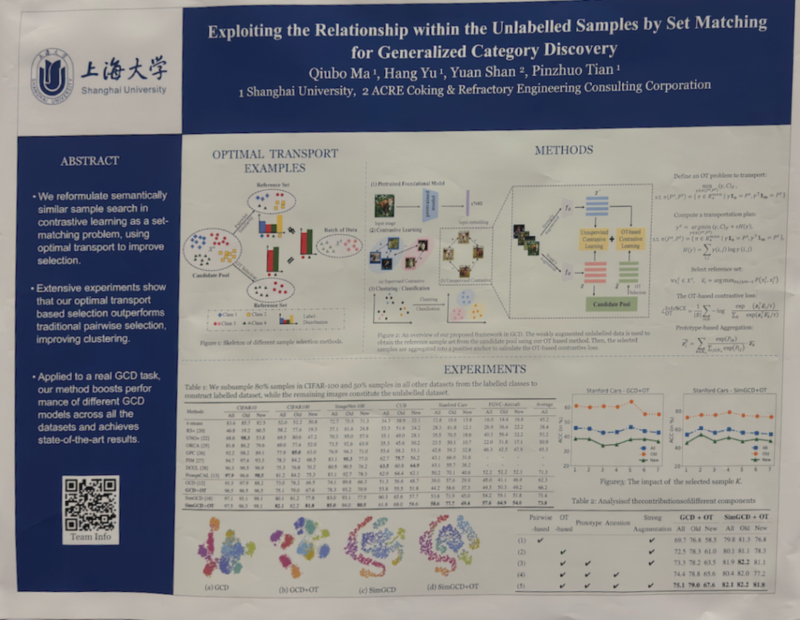 | Exploiting the relationship within the unlabelled samples by set matching for generalized category discovery | *Qiubo Ma', Hang Yu\%, Yuan Shan 3, Pinzhuo Tian 1*, [Exploiting the relationship within the unlabelled samples by set matching for generalized category discovery](https://ieeexplore.ieee.org/abstract/document/10889522/) | 
| 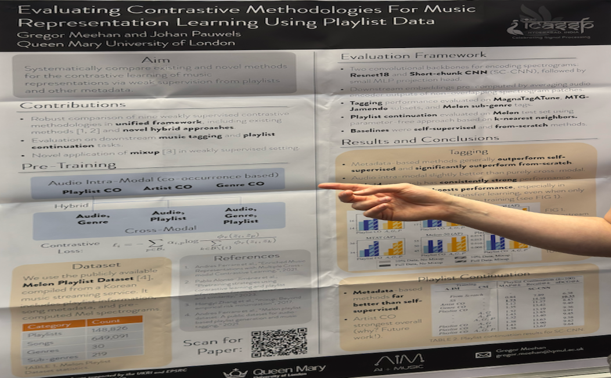 | Evaluating Contrastive Methodologies for Music Representation Learning Using Playlist Data | *methods {[}1, 2{]} and novel hybrid approaches*, [Evaluating Contrastive Methodologies for Music Representation Learning Using Playlist Data](https://ieeexplore.ieee.org/abstract/document/10888157/) | 
| 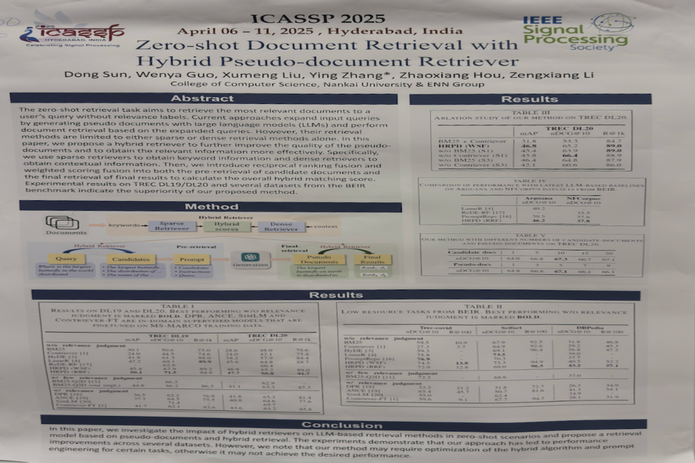 | Fine-tuning and prompt optimization: Two great steps that work better together | *Dong Sun, Wenya Guo, Xumeng Liu, Ying Zhang*, Zhaoxiang Hou, Zengxiang Li*, [Fine{-}tuning and prompt optimization: Two great steps that work better together](https://arxiv.org/abs/2407.10930) | 
| 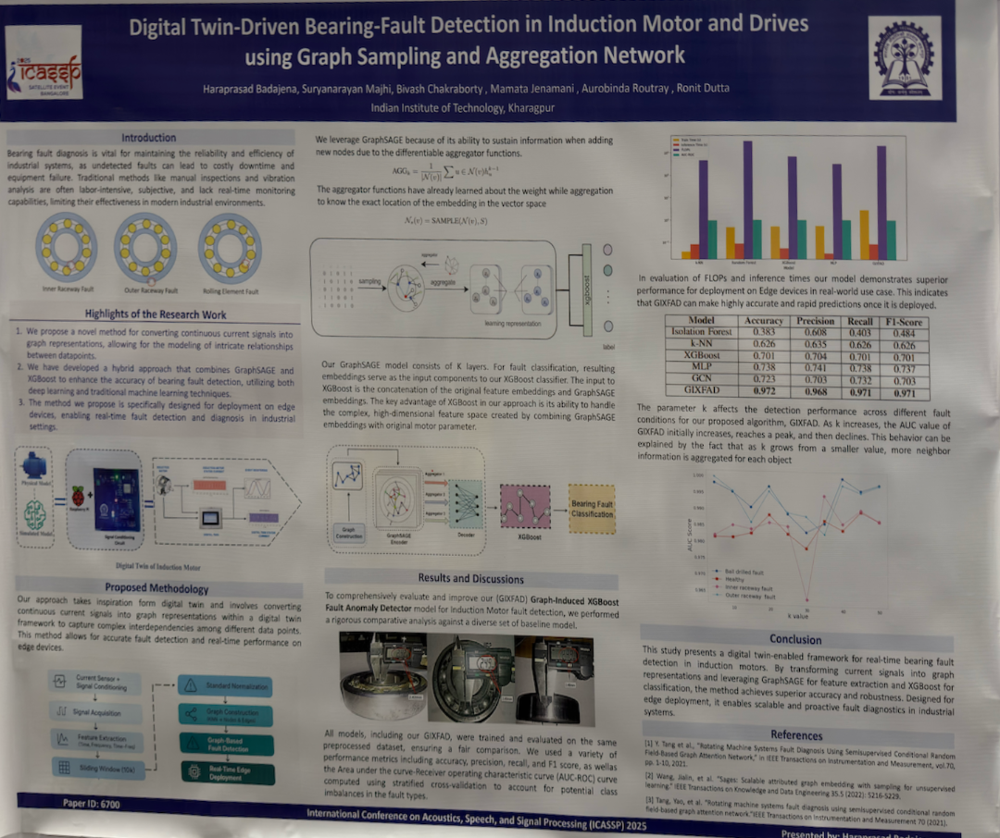 | Digital Twin-Driven Bearing-Fault Detection in Induction Motor and Drives using Graph Sampling and Aggregation Network | *Haraprasad Badajena, Suryanarayan Majhi, Bivash Chakraborty, Mamata Jenamani, Aurobinda Routray, Ronit Dutta*, [Digital Twin{-}Driven Bearing{-}Fault Detection in Induction Motor and Drives using Graph Sampling and Aggregation Network](https://ieeexplore.ieee.org/abstract/document/10889484/) | 
| 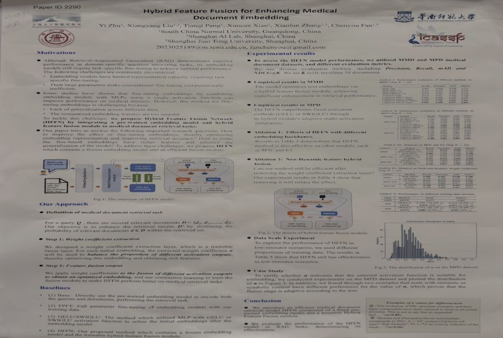 | Hybrid Feature Fusion for Enhancing Medical Document Embedding | *Yi Zhu', Xiangyang Liu!?, Tianqi Pang', Xuncan Xiao!, Xiaofan Zhang33, Chenyou Fan!.**, [Hybrid Feature Fusion for Enhancing Medical Document Embedding](https://ieeexplore.ieee.org/abstract/document/10888956/) | 
| 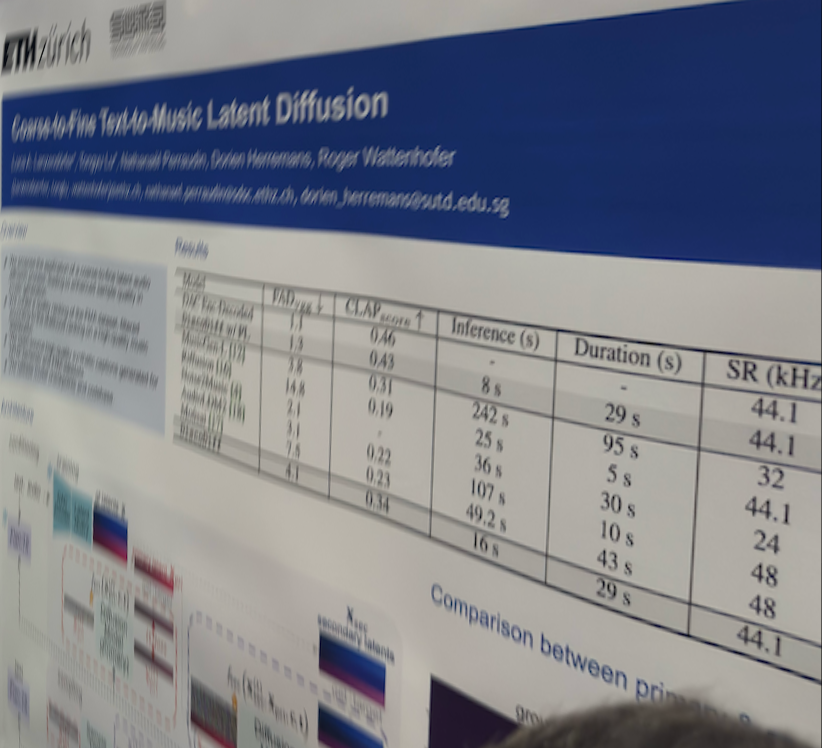 | Text to music audio generation using latent diffusion model: A re-engineering of audioldm model | *1nh tonne Wegner Neteal Ponesin, Deren Hertemans, Rogger Wattenhofer*, [Text to music audio generation using latent diffusion model: A re{-}engineering of audioldm model](https://www.diva{-}portal.org/smash/record.jsf?pid=diva2:1845150) | 
| 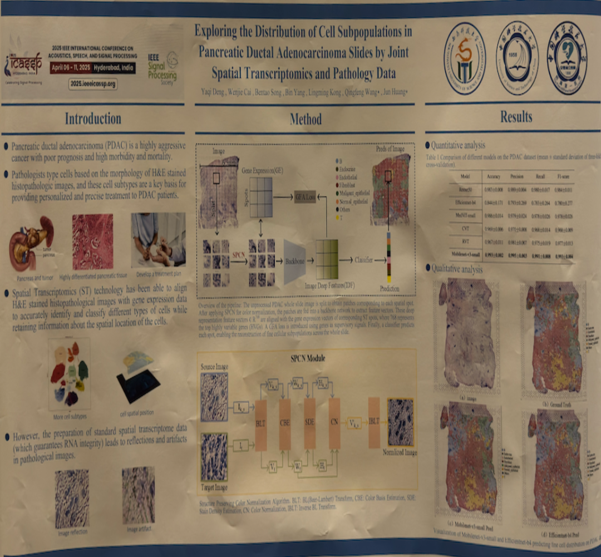 | Exploring the Distribution of Cell Subpopulations in Pancreatic Ductal Adenocarcinoma Slides by Joint Spatial Transcriptomics and Pathology Data | *Yagi Deng, Wenjie Cai, Bentao Song, Bin Yang, Lingming Kong, Qingfeng Wang», Jun Huang*, [Exploring the Distribution of Cell Subpopulations in Pancreatic Ductal Adenocarcinoma Slides by Joint Spatial Transcriptomics and Pathology Data](https://ieeexplore.ieee.org/abstract/document/10890640/) | 
| 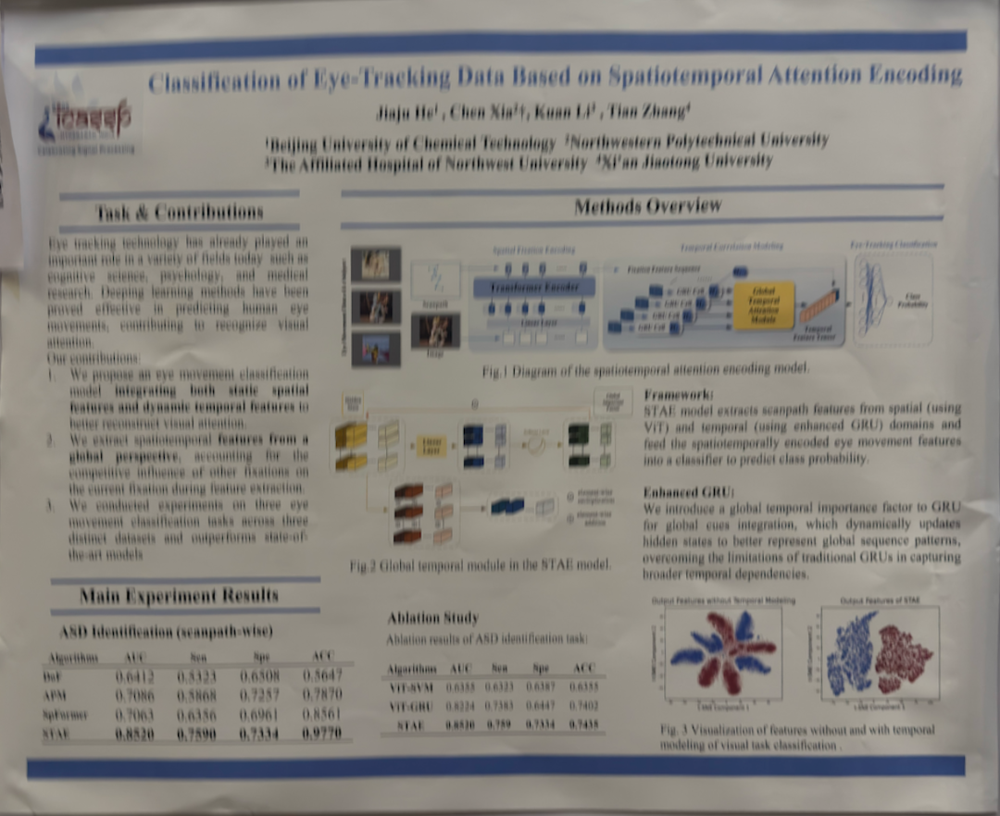 | Classification of Eye-Tracking Data Based on Spatiotemporal Attention Encoding | *Maju Hel, Chen Xia't, Kuan L, Tan Zhangt*, [Classification of Eye{-}Tracking Data Based on Spatiotemporal Attention Encoding](https://ieeexplore.ieee.org/abstract/document/10889246/) | 
| 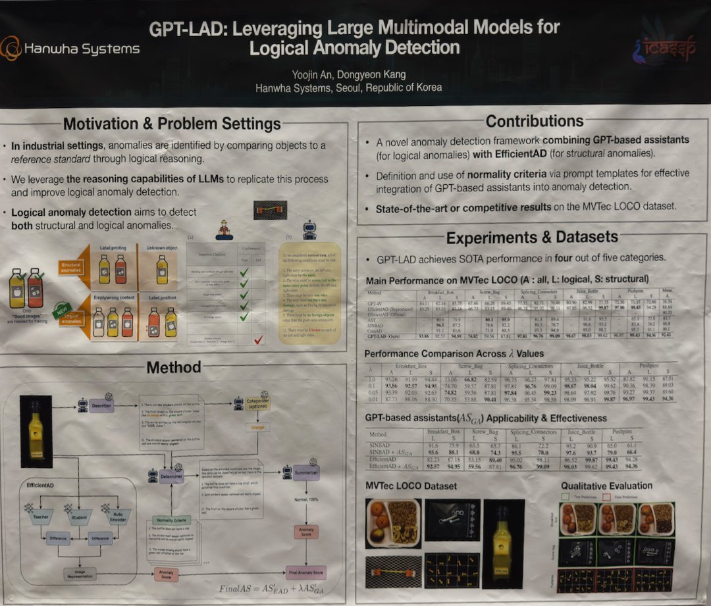 | GPT-LAD: Leveraging Large Multimodal Models for Logical Anomaly Detection | *Main Performance on MVTec LOCO (A : all, L: logical, S: structural)*, [GPT{-}LAD: Leveraging Large Multimodal Models for Logical Anomaly Detection](https://ieeexplore.ieee.org/abstract/document/10888757/) | 
| 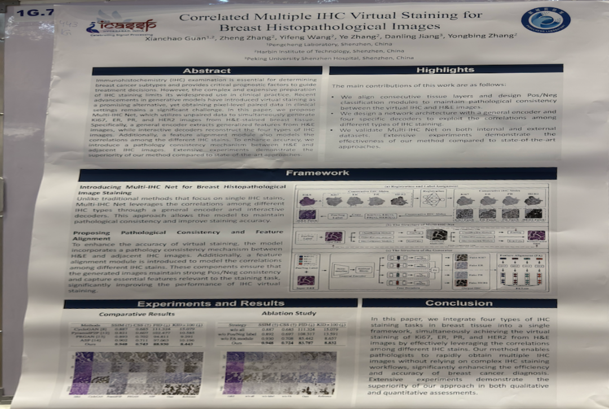 | Virtual multiplex immunohistochemistry: application on cell block of effusion and aspiration cytology | *Xianchao Guan12, Zheng Zhang?, Yifeng Wang?, Ye Zhang?, Danling Jiang", Yongbing Zhang?*, [Virtual multiplex immunohistochemistry: application on cell block of effusion and aspiration cytology](https://onlinelibrary.wiley.com/doi/abs/10.1002/dc.24344) | 
| 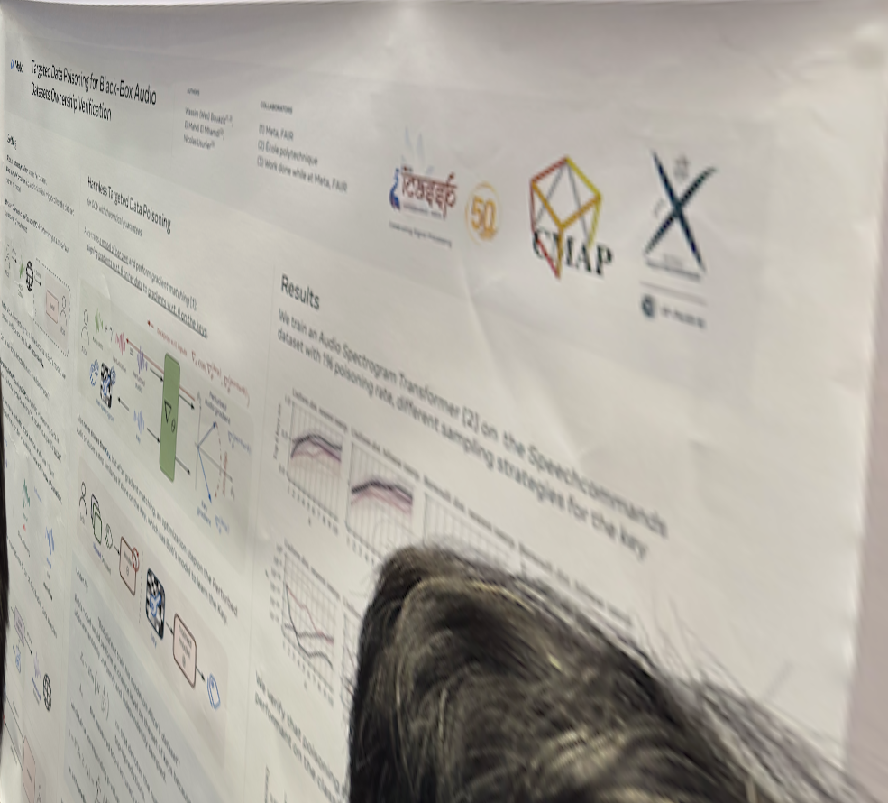 | Vie sin an Aude Spectresun Taedome 981 on the Speechcommanda | *Vie sin an Aude Spectresun Taedome 981 on the Speechcommanda*, [Vie sin an Aude Spectresun Taedome 981 on the Speechcommanda]() | 
|  | Exploring the Distribution of Cell Subpopulations in Pancreatic Ductal Adenocarcinoma Slides by Joint Spatial Transcriptomics and Pathology Data | *Yagi Deng, M cnje Cai, Benao Song, Bin Yang, Limphing Kung , Qedeng Pung» , Jam H*, [Exploring the Distribution of Cell Subpopulations in Pancreatic Ductal Adenocarcinoma Slides by Joint Spatial Transcriptomics and Pathology Data](https://ieeexplore.ieee.org/abstract/document/10890640/) | 
| 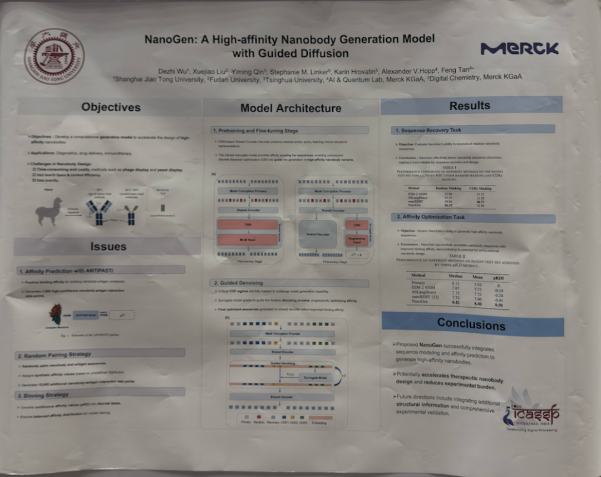 | NanoGen: A High-affinity Nanobody Generation Model with Guided Diffusion | *Dezhi Wu', Xuejiao Liu?, Yiming Qin", Stephanie M. Linker', Karin Hrovatin", Alexander V.Hopp*, Feng Tan***, [NanoGen: A High{-}affinity Nanobody Generation Model with Guided Diffusion](https://ieeexplore.ieee.org/abstract/document/10888039/) | 
| 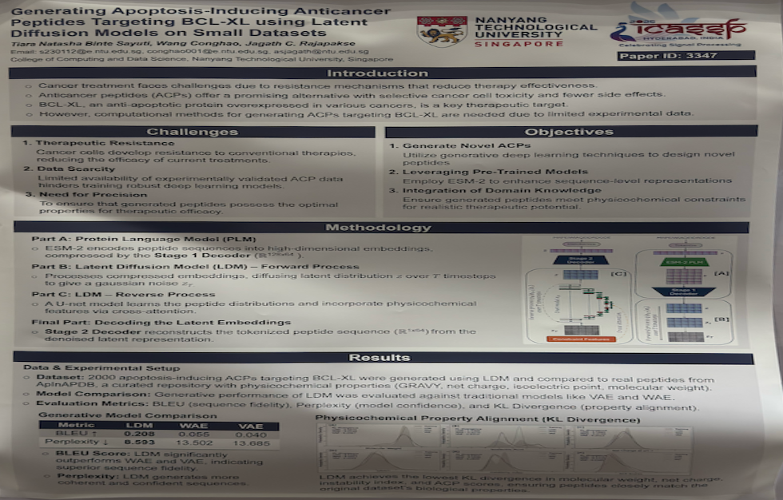 | ADPDB: A comprehensive knowledgebase of manually curated peptides against dengue virus | *Emas: 2230112006.M.00u.59. cong na00012e.ntu.edu.sg. as.293th@ntu.edu.5g*, [ADPDB: A comprehensive knowledgebase of manually curated peptides against dengue virus](https://link.springer.com/article/10.1007/s10989{-}024{-}10610{-}0) | 
| 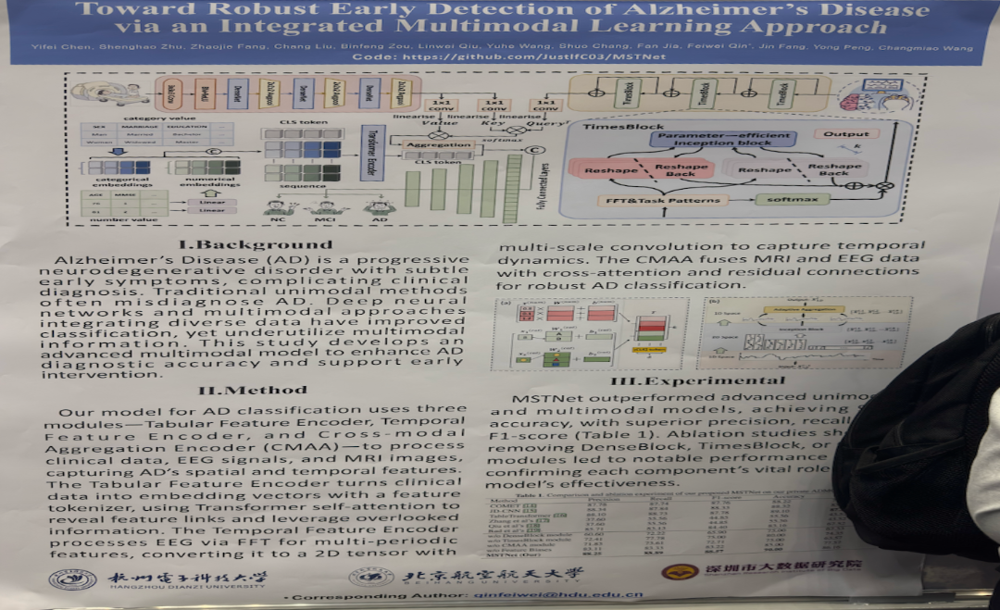 | Toward robust early detection of alzheimer's disease via an integrated multimodal learning approach | *Yifei Chen, Shenghao Zhu. Zhaojie Fang. Chang Liu, Binfeng Zou, Linwei Qiu, Yuhe Wang. Shuo Chang. Fan Jia, Felwel Qin". Jin Fang. Yong Peng, Changmiao Wang*, [Toward robust early detection of alzheimer's disease via an integrated multimodal learning approach](https://ieeexplore.ieee.org/abstract/document/10888363/) | 
| 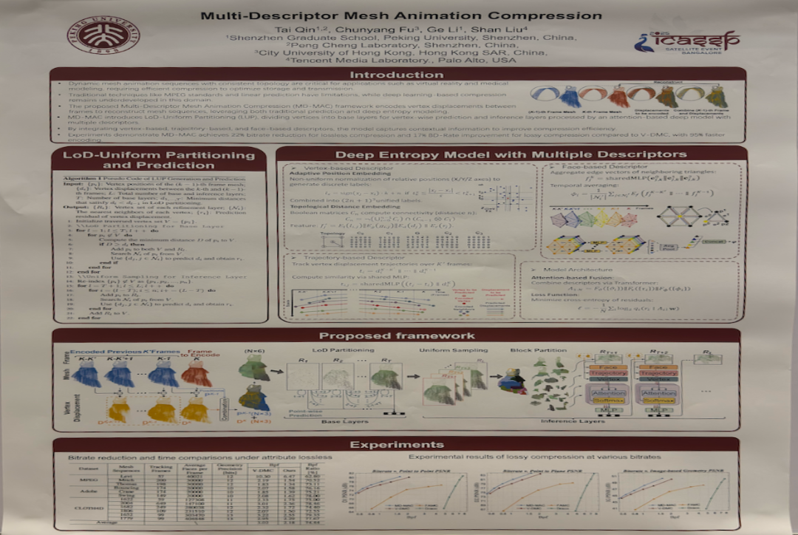 | Experiments demonstrato MD-MAC achieves 22% bitrate reduction for lossless compression and 17% BD-Rate improvement for lossy compression compared to V-DMC, with 95% faster | *1Shenzhen Graduate School, Peking University, Shenzhen, China,*, [Experiments demonstrato MD{-}MAC achieves 22\% bitrate reduction for lossless compression and 17\% BD{-}Rate improvement for lossy compression compared to V{-}DMC, with 95\% faster]() | 
| 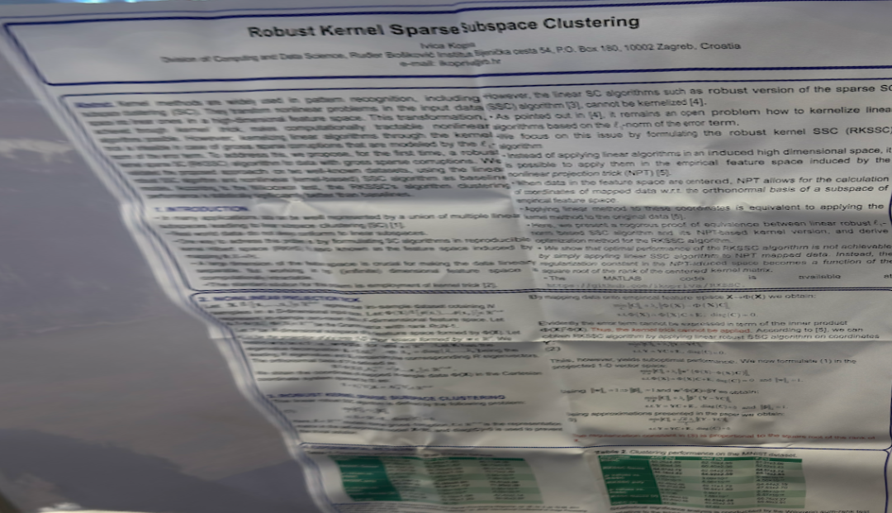 | Robust kernel sparse subspace clustering | *da cesta 54, P.O. Box 180, 10002 Zagrob, Croatia*, [Robust kernel sparse subspace clustering](https://ieeexplore.ieee.org/abstract/document/10888170/) | 
| 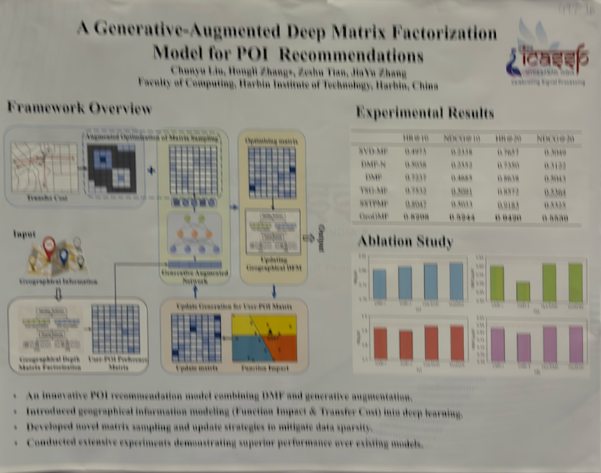 | A generative-augmented deep matrix factorization model for poi recommendations | *Chonse Lio, Hongl Zhange, Aesta Man, Masa Zhang*, [A generative{-}augmented deep matrix factorization model for poi recommendations](https://ieeexplore.ieee.org/abstract/document/10890082/) | 
| 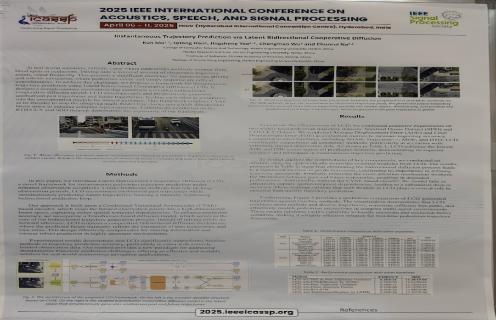 | 2011 IEEE International Conference on Acoustics, Speech, and Signal Processing | *Kun Ma12, Qilong Han', Jingzheng Yao?.*, Changmao Wu' and Chunrul NazA*, [2011 IEEE International Conference on Acoustics, Speech, and Signal Processing](https://ieeexplore.ieee.org/abstract/document/5947741/) | 
| 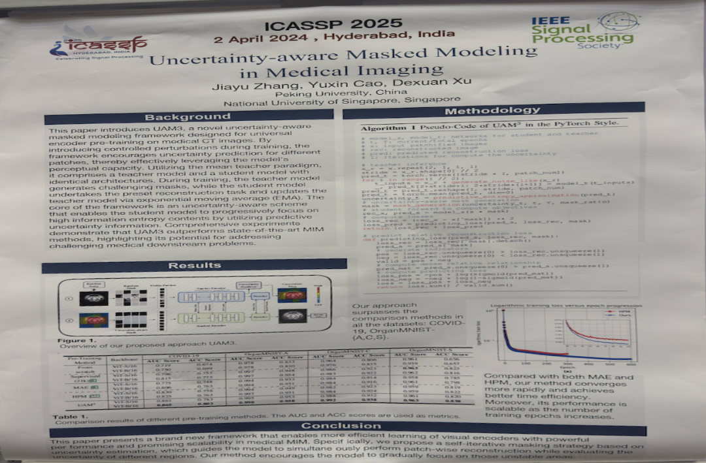 | Masked image modeling advances 3d medical image analysis | *Der formance and promising scalability in medical MIM. Spect ically, we propose a telliterative masking stratcoy based on*, [Masked image modeling advances 3d medical image analysis](https://openaccess.thecvf.com/content/WACV2023/html/Chen\_Masked\_Image\_Modeling\_Advances\_3D\_Medical\_Image\_Analysis\_WACV\_2023\_paper.html) | 
|  | Latent watermarking of audio generative models | *Losses .....*Inlt..*, [Latent watermarking of audio generative models](https://ieeexplore.ieee.org/abstract/document/10889782/) | 
| 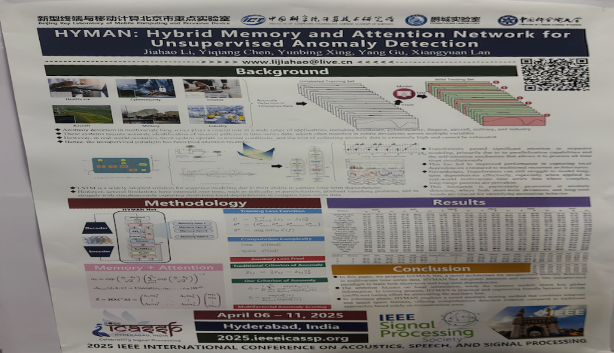 | Hyman: Hybrid memory and attention network for unsupervised anomaly detection | *Jiahao Li, Yigiang Chen, Yunbing Xing, Yang Gu, Xiangyuan Lan*, [Hyman: Hybrid memory and attention network for unsupervised anomaly detection](https://ieeexplore.ieee.org/abstract/document/10890028/) | 
| 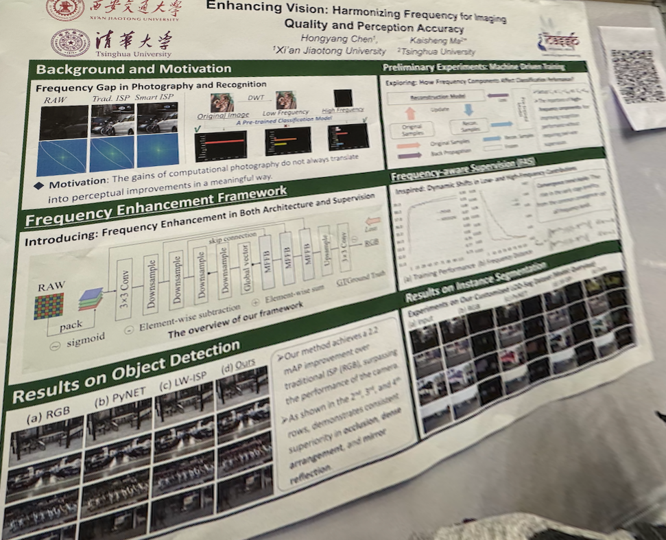 | Performance evaluation of object detection and tracking systems | *›As shown in the 29, 3P\%, and 4°*, [Performance evaluation of object detection and tracking systems](https://www.academia.edu/download/67298837/download.pdf\#page=15) | 
| 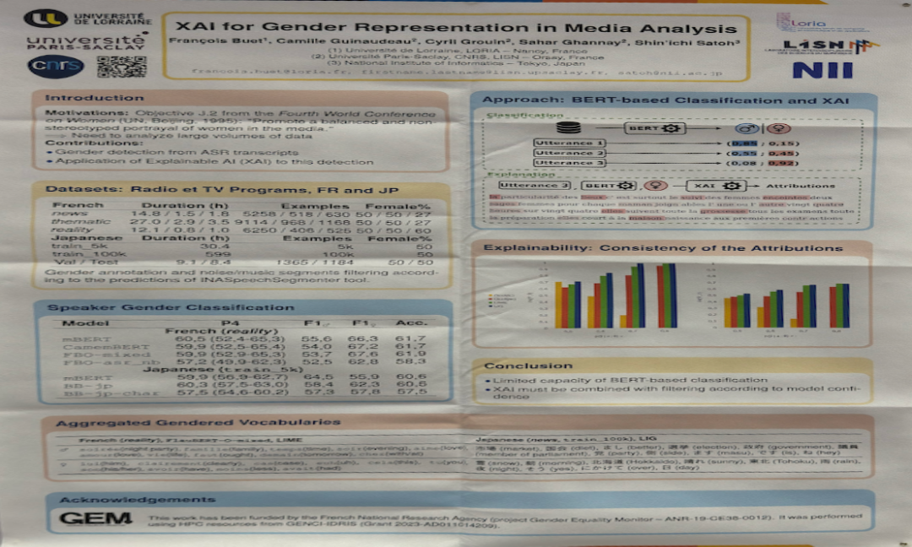 | XD0h 18122089roject Gender Equalty Monitor - ANIR-19-GE30-0012). It was portormed | *Françols Buot', Camille Guinaudeau?, Cyril Grouin?, Sahar Ghannay?, Shin'ichi Satoh»*, [XD0h 18122089roject Gender Equalty Monitor {-} ANIR{-}19{-}GE30{-}0012). It was portormed]() | 
|  | Latent watermarking of audio generative models | *13) Olfonses, Alexandre, Jade Copet, Gabriel Synarve, and Yest Adt. "High fidelity*, [Latent watermarking of audio generative models](https://ieeexplore.ieee.org/abstract/document/10889782/) | 
| 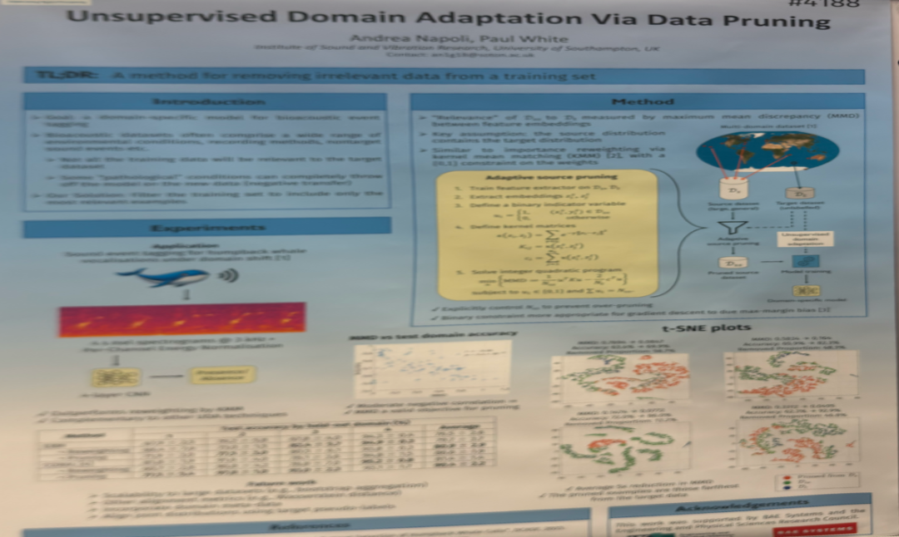 | Unsupervised Domain Adaptation Via Data Pruning | *TWDR. \& method for removing irrelevant data from a training set*, [Unsupervised Domain Adaptation Via Data Pruning](https://ieeexplore.ieee.org/abstract/document/10890190/) | 
| 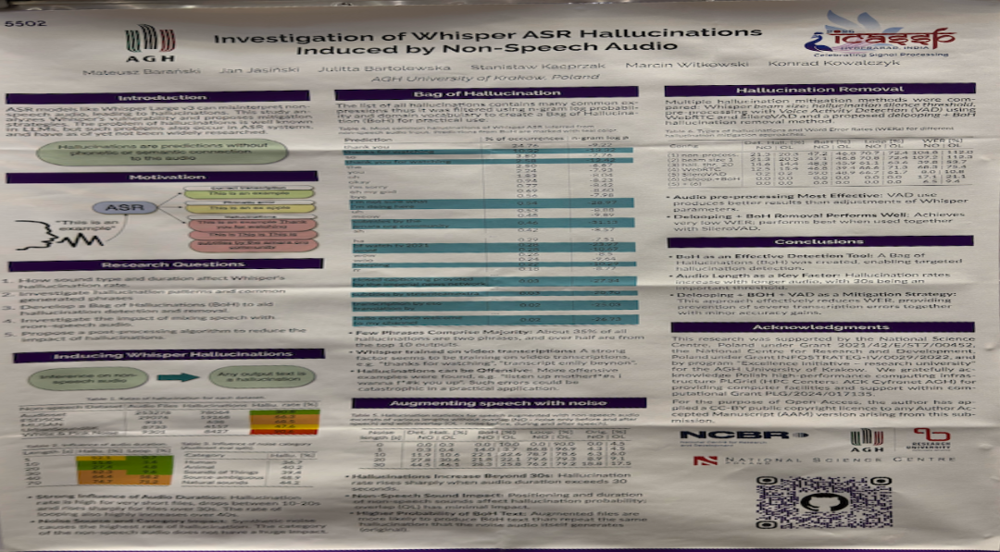 | Investigation of whisper asr hallucinations induced by non-speech audio | *AGH University of Krakow. Poland*, [Investigation of whisper asr hallucinations induced by non{-}speech audio](https://ieeexplore.ieee.org/abstract/document/10890105/) | 
| 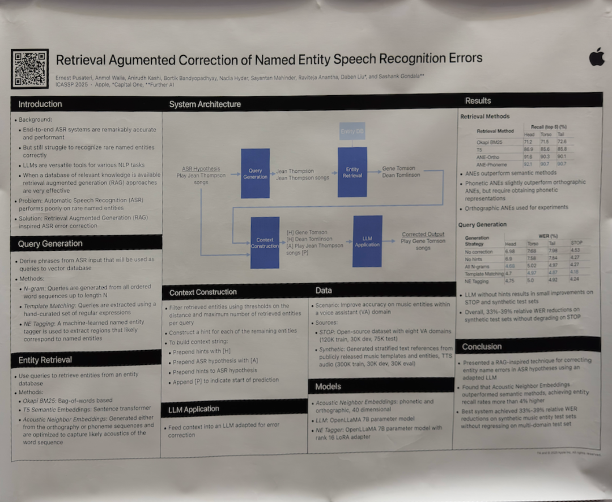 | Retrieval augmented correction of named entity speech recognition errors | *Ernest Pusateri, Anmol Walia, Aniruch Kashi, Bortik Bandyopadhyay, Nadia Hyder, Sayantan Mahinder, Raviteja Anantha, Daben Liu*, and Sashank Gondala***, [Retrieval augmented correction of named entity speech recognition errors](https://ieeexplore.ieee.org/abstract/document/10888936/) | 
| 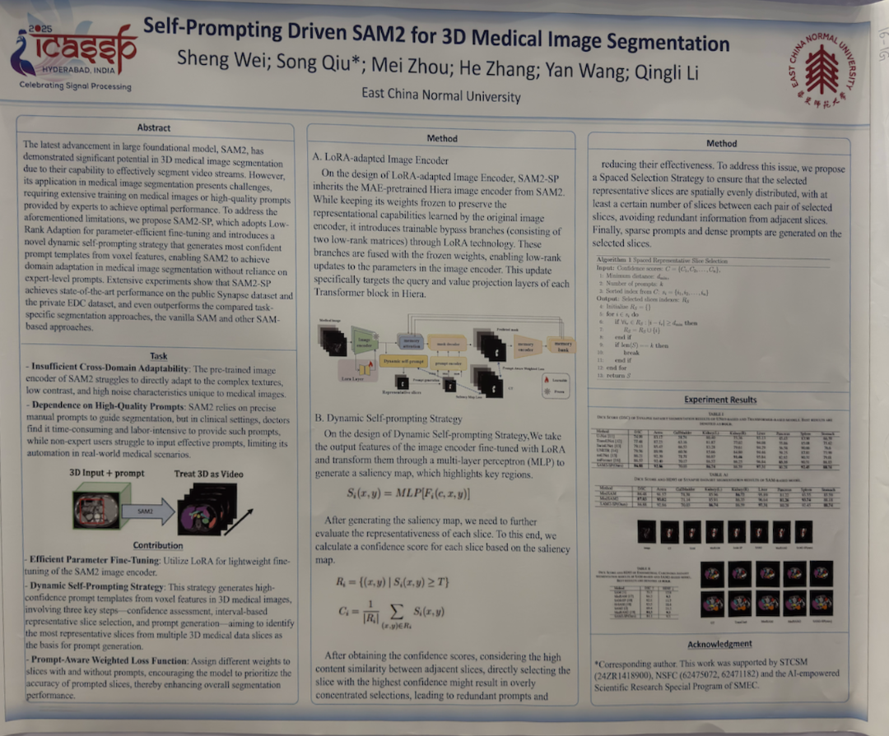 | Self-Prompting Driven SAM2 for 3D Medical Image Segmentation | *a Sorted index from C: s, {-} (6r,62..., 62...,4)*, [Self{-}Prompting Driven SAM2 for 3D Medical Image Segmentation](https://ieeexplore.ieee.org/abstract/document/10889344/) | 
| 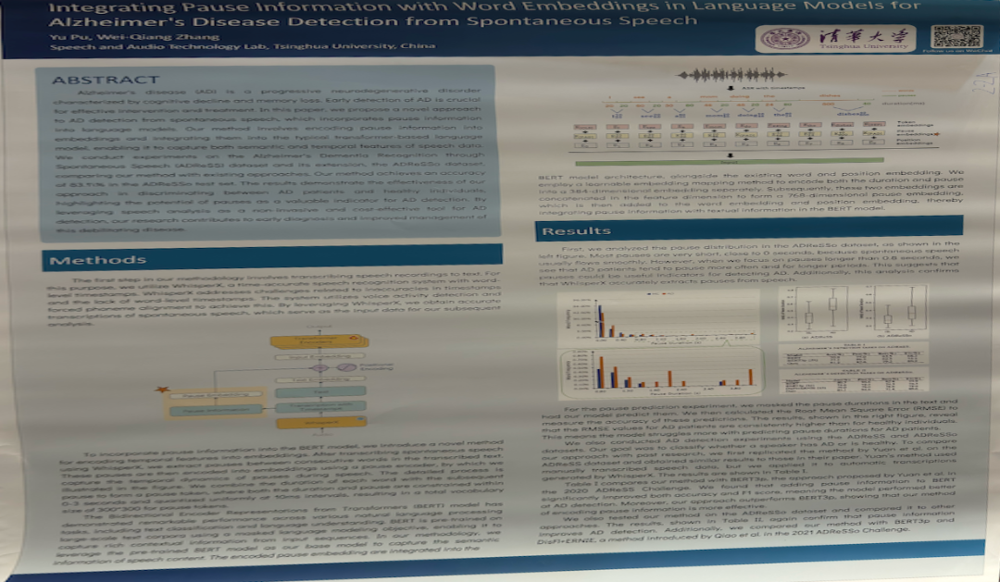 | Integrating Pause Information with Word Embeddings in Language Models for Alzheimer's Disease Detection from Spontaneous Speech | *Speech and Audio Technology lab, Tsinghua University, China*, [Integrating Pause Information with Word Embeddings in Language Models for Alzheimer's Disease Detection from Spontaneous Speech](https://ieeexplore.ieee.org/abstract/document/10888563/) | 
| 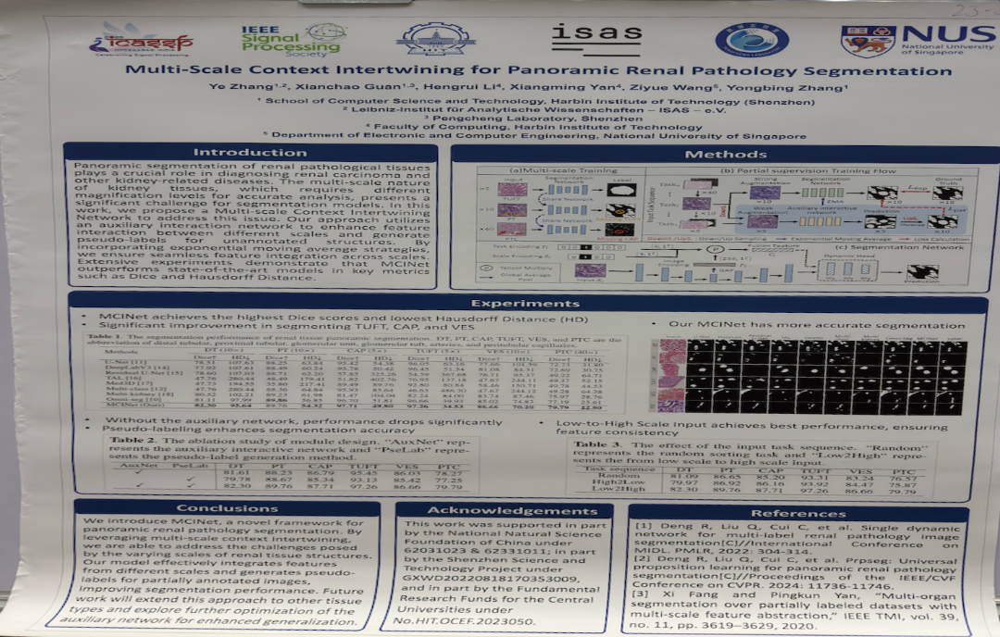 | Multi-scale Context Intertwining for Panoramic Renal Pathology Segmentation | *Ye Zhang'2, Xlanchao Guan13, Hengrul LI", Xiangming Yan", Ziyue Wang", Yongbing Zhang'*, [Multi{-}scale Context Intertwining for Panoramic Renal Pathology Segmentation](https://ieeexplore.ieee.org/abstract/document/10889659/) | 
| 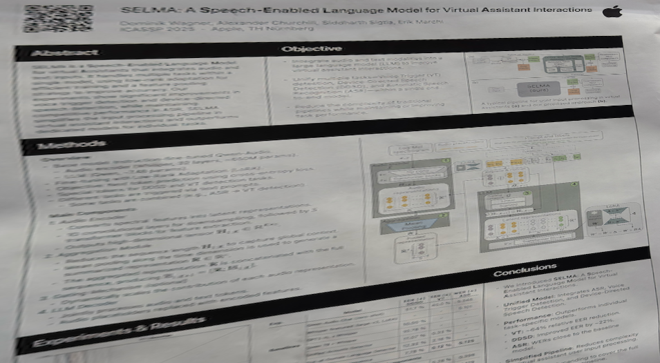 | SELMA: A Speech-Enabled Language Model for Virtual Assistant Interactions | *Simplified Pigstina, Meduces complarty*, [SELMA: A Speech{-}Enabled Language Model for Virtual Assistant Interactions](https://ieeexplore.ieee.org/abstract/document/10890139/) | 
| 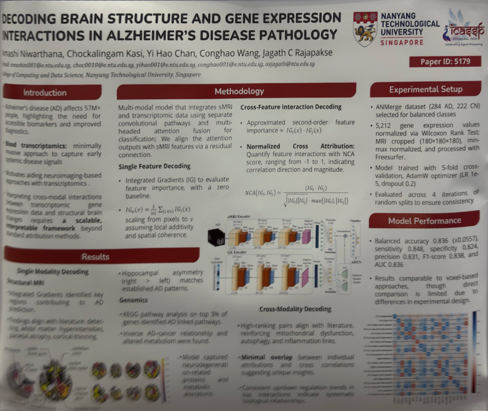 | Glial‐neuronal interactions in Alzheimer's disease: the potential role of a 'cytokine cycle'in disease progression | *hutcmoshini001@Bentuedusg, choc0010@e.ntu.edusg,yihao001@e.ntu.edusg, conghao001@e.ntu.edusg,asjagath@ntu.edu.sg*, [Glial‐neuronal interactions in Alzheimer's disease: the potential role of a 'cytokine cycle'in disease progression](https://onlinelibrary.wiley.com/doi/abs/10.1111/j.1750{-}3639.1998.tb00136.x) | 
| 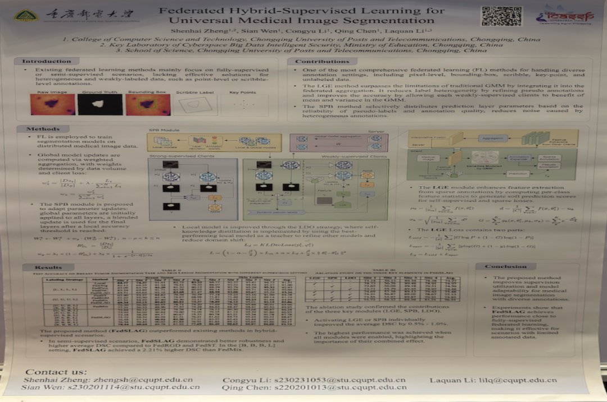 | Wireless Sensor Networks: 13th China Conference, CWSN 2019, Chongqing, China, October 12–14, 2019, Revised Selected Papers | *1. College of Computer Science and Technology, Chongging University of Posts and Telecommunications, Chongging. China*, [Wireless Sensor Networks: 13th China Conference, CWSN 2019, Chongqing, China, October 12–14, 2019, Revised Selected Papers](https://books.google.com/books?hl=en\&lr=\&id=o3fADwAAQBAJ\&oi=fnd\&pg=PR6\&dq=1.+College+of+Computer+Science+and+Technology,+Chongging+University+of+Posts+and+Telecommunications,+Chongging.+China\&ots=xK5tdJxqE6\&sig=49RR4LsIhUDMwMlUVyyZO\_Et08I) | 
| 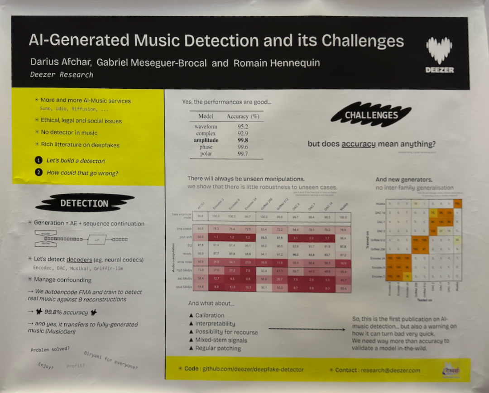 | AI-Generated Music Detection and its Challenges | *Suno, Udio, Riffusion, ...*, [AI{-}Generated Music Detection and its Challenges](https://ieeexplore.ieee.org/abstract/document/10890655/) | 
| 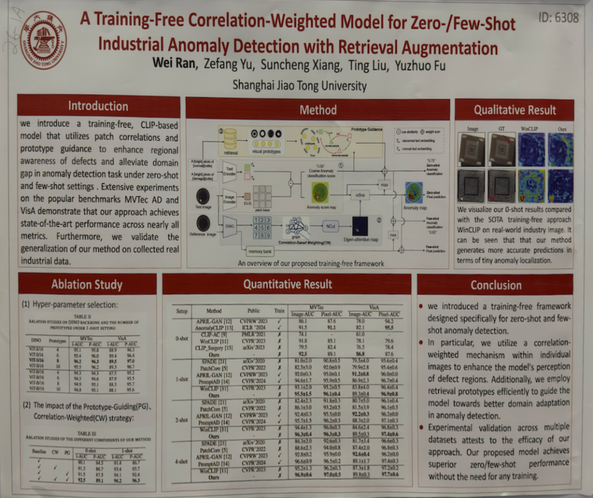 | A Training-Free Correlation-Weighted Model for Zero-/Few-Shot Industrial Anomaly Detection with Retrieval Augmentation | *Wei Ran, Zefang Yu, Suncheng Xiang, Ting Liu, Yuzhuo Fu*, [A Training{-}Free Correlation{-}Weighted Model for Zero{-}/Few{-}Shot Industrial Anomaly Detection with Retrieval Augmentation](https://ieeexplore.ieee.org/abstract/document/10890083/) | 
| 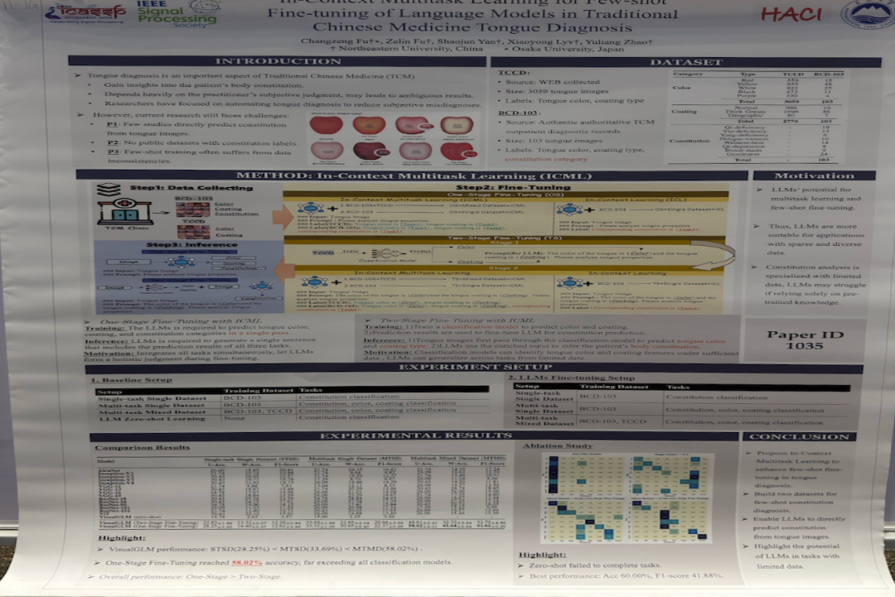 | Parameter-efficient fine-tuning of large-scale pre-trained language models | *Changzeng Fits, Zelin Fut, Shaojun Yant. Xiaoyong Lyvt, Yuliang Zhaot*, [Parameter{-}efficient fine{-}tuning of large{-}scale pre{-}trained language models](https://www.nature.com/articles/s42256{-}023{-}00626{-}4) | 
