| **Poster** | **Title** | **Information** | 
| -- | -- | -- | 
| 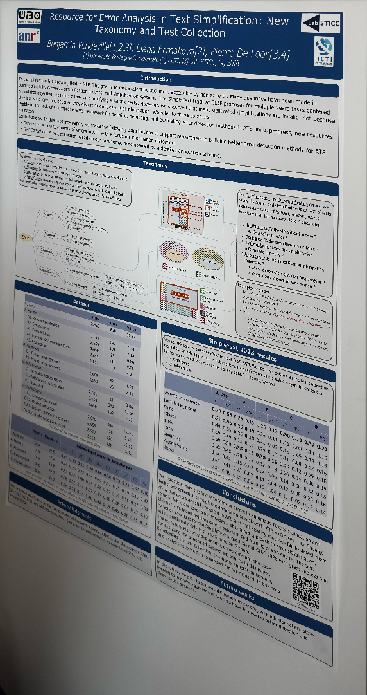 | The Agent Perspective In LLM-Based Strategic Information Retrieval Ecosystems | *0.56 0.35 0.15 0.06 0.10 0.04 0.11 0.07 0.17 0.14*, [The Agent Perspective In LLM{-}Based Strategic Information Retrieval Ecosystems](https://doi.org/10.1145/3726302.3730125) | 
| 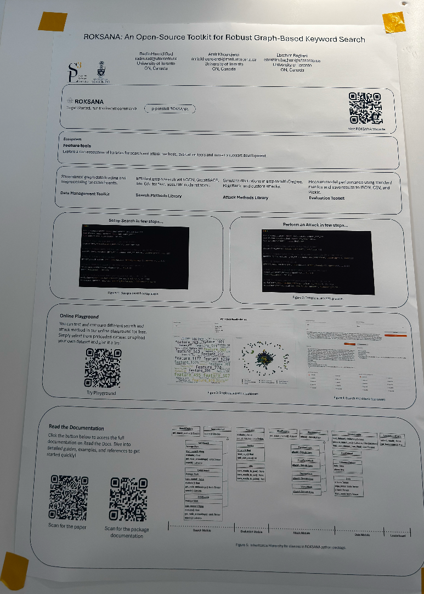 | ROKSANA: An Open-Source Toolkit for Robust Graph-Based Keyword Search | *equeries, gold set, resus before, k. values{-}15, 10, 201)*, [ROKSANA: An Open{-}Source Toolkit for Robust Graph{-}Based Keyword Search](https://doi.org/10.1145/3726302.3730154) | 
| 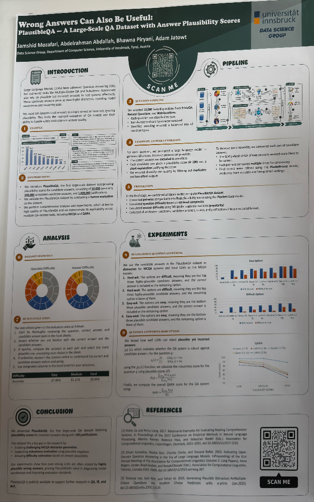 | Wrong Answers Can Also Be Useful: PlausibleQA — A Large-Scale QA Dataset with Answer Plausibility Scores | *100,000 annotated candidate answers, and 1,000,000 justifications.*, [Wrong Answers Can Also Be Useful: PlausibleQA — A Large{-}Scale QA Dataset with Answer Plausibility Scores](https://doi.org/10.1145/3726302.3730299) | 
| 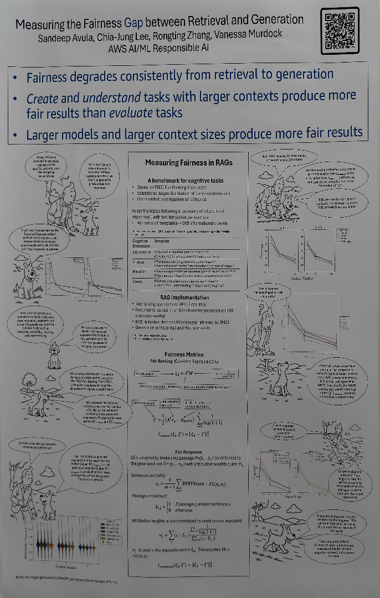 | Conversational Search: Towards Personalization and Evaluation | *the generated text G = (5,... Sm with attribution weights c; and E,*, [Conversational Search: Towards Personalization and Evaluation](https://doi.org/10.1145/3726302.3730126) | 
| 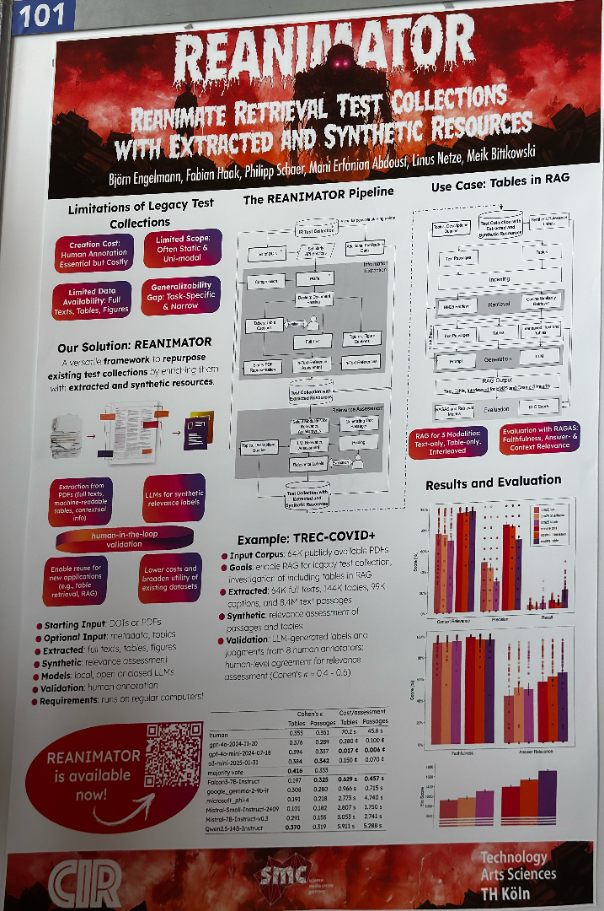 | REANIMATOR: Reanimate Retrieval Test Collections with Extracted and Synthetic Resources | *Björn Engelmann, Fabian Haak, Philipp Scher, Mani Erfanian Abdoust, Linus Netze, Meik Bikowski*, [REANIMATOR: Reanimate Retrieval Test Collections with Extracted and Synthetic Resources](https://doi.org/10.1145/3726302.3730342) | 
| 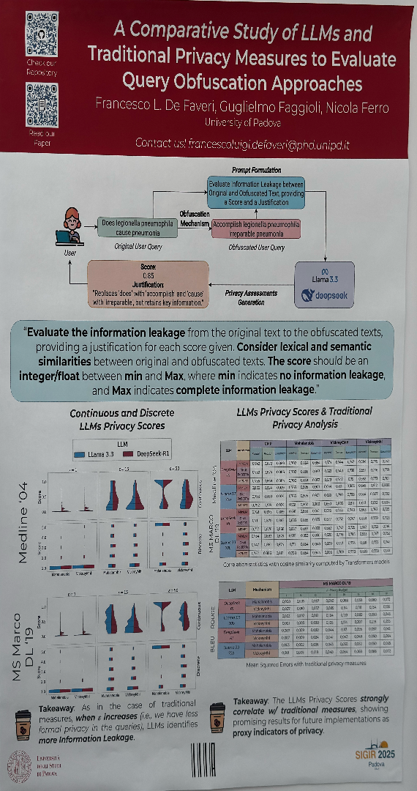 | A Comparative Study of Large Language Models and Traditional Privacy Measures to Evaluate Query Obfuscation Approaches | *measures, when e increases (i.e., we have less*, [A Comparative Study of Large Language Models and Traditional Privacy Measures to Evaluate Query Obfuscation Approaches](https://doi.org/10.1145/3726302.3730158) | 
| 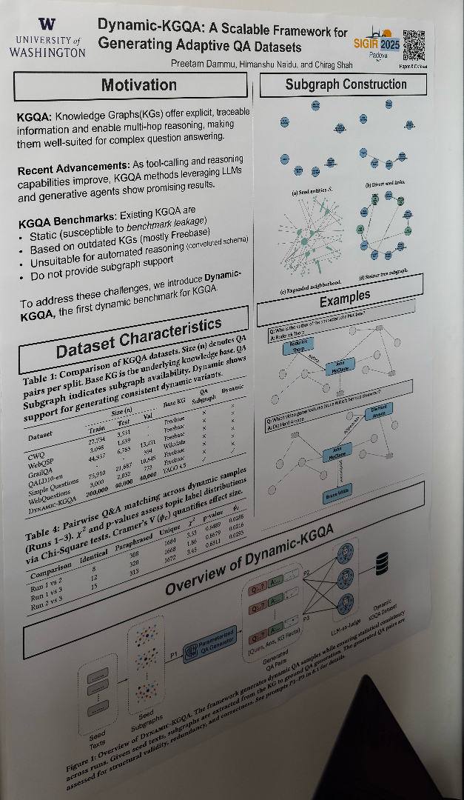 | Dynamic-KGQA: A Scalable Framework for Generating Adaptive Question Answering Datasets | *assessed for structural validity, redundancy, and correctness. See prompts P1{-}P3 in 8.1 for details.*, [Dynamic{-}KGQA: A Scalable Framework for Generating Adaptive Question Answering Datasets](https://doi.org/10.1145/3726302.3730324) | 
| 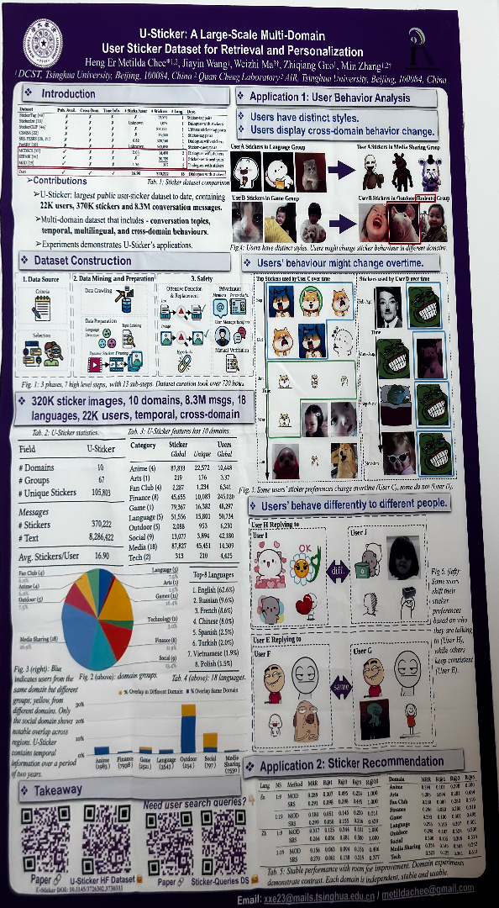 | The Agent Perspective In LLM-Based Strategic Information Retrieval Ecosystems | *'DCST, Tsinghua University, Beijing, 100084, China 2 Quan Cheng Laboratory2 AIR, Tsinghua University, Beijing, 100084, China*, [The Agent Perspective In LLM{-}Based Strategic Information Retrieval Ecosystems](https://doi.org/10.1145/3726302.3730125) | 
| 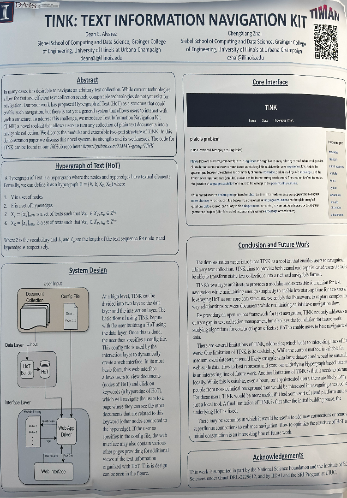 | TINK: Text Information Navigation Kit | *3. X, = {[}Xo\}vev is a set of texts such that VX, E Xv, X, € Z*, [TINK: Text Information Navigation Kit](https://doi.org/10.1145/3726302.3730141) | 
| 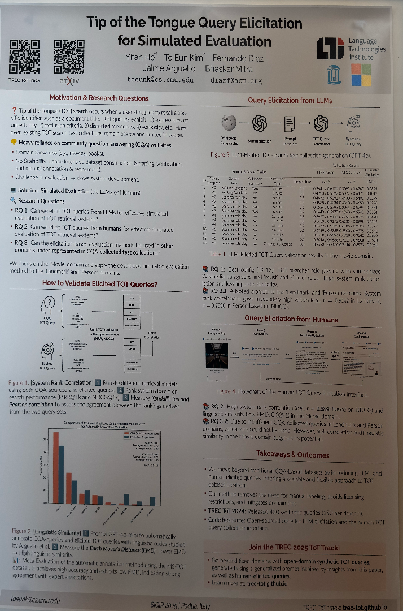 | Tip of the Tongue Query Elicitation for Simulated Evaluation | *rank correlations gave moderately high values (e.g., r = 0.9142 in Landmark,*, [Tip of the Tongue Query Elicitation for Simulated Evaluation](https://doi.org/10.1145/3726302.3730335) | 
| 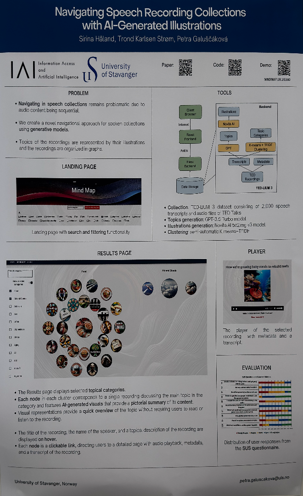 | Navigating Speech Recording Collections with AI-Generated Illustrations | *Sirina Häland, Trond Karlsen Strom, Petra Galuscáková*, [Navigating Speech Recording Collections with AI{-}Generated Illustrations](https://doi.org/10.1145/3726302.3730136) | 
