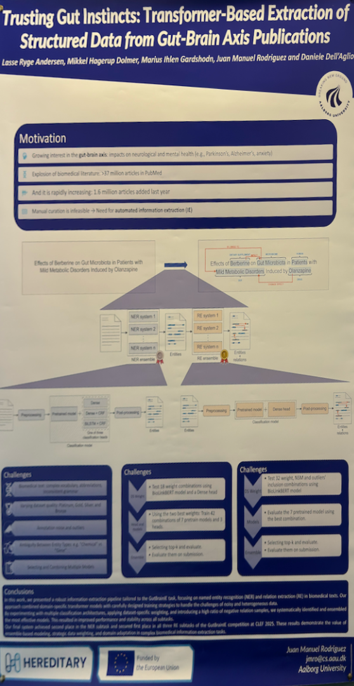
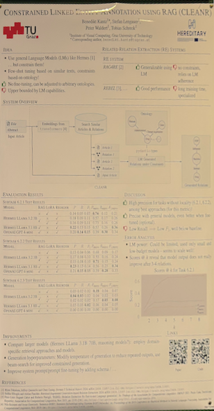
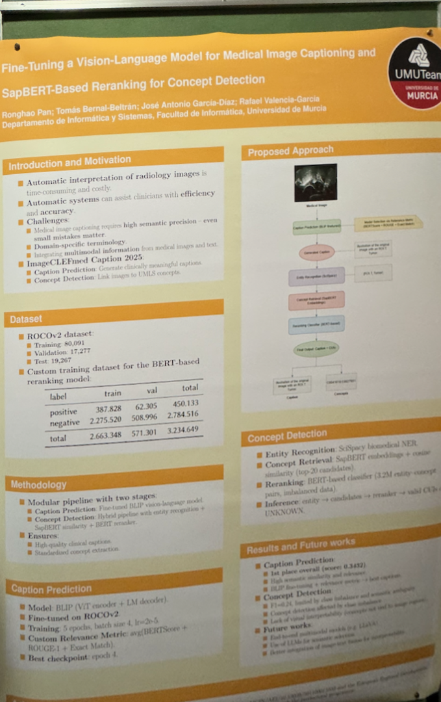

| **Poster** | **Title** | **Information** | 
| -- | -- | -- | 
|  | Trusting Gut Instincts: Transformer-Based Extraction of Structured Data from Gut-Brain Axis Publications | *Lasse Ryge Andersen, Mikkel Hagerup Dolmer, Marius Ihlen Gardshodn, Juan Manuel Rodriguez and Daniele Dell'Aglic*, [Trusting Gut Instincts: Transformer{-}Based Extraction of Structured Data from Gut{-}Brain Axis Publications](https://ceur{-}ws.org/Vol{-}4038/paper\_6.pdf) | 
|  | Constrained Linked Entity ANnotation using RAG (CLEANR) | *Upper bounded by I.M capablises.*, [Constrained Linked Entity ANnotation using RAG (CLEANR)](https://ceur{-}ws.org/Vol{-}4038/paper\_23.pdf) | 
|  | UMUTeam at ImageCLEF 2025: Fine-Tuning a Vision-Language Model for Medical Image Captioning and SapBERT-Based Reranking for Concept Detection | *\# Standardied concept, extraction.*, [UMUTeam at ImageCLEF 2025: Fine{-}Tuning a Vision{-}Language Model for Medical Image Captioning and SapBERT{-}Based Reranking for Concept Detection](https://ceur{-}ws.org/Vol{-}4038/paper\_200.pdf) | 
