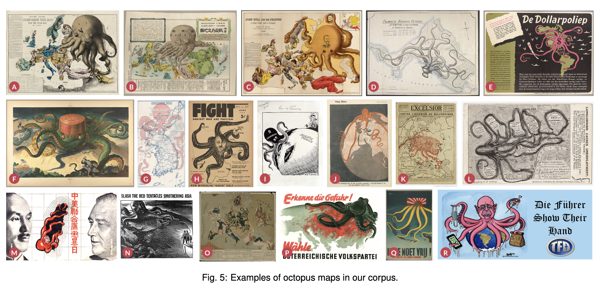
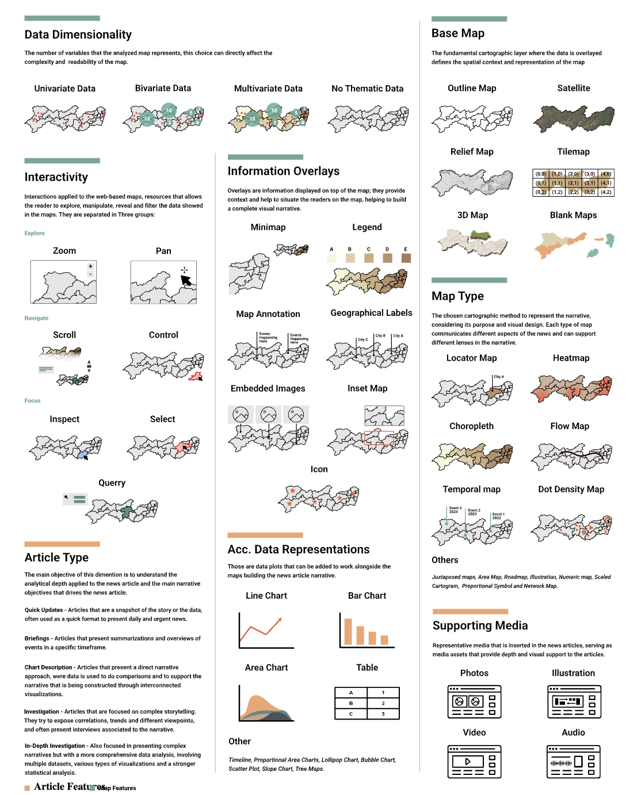

# Workshshops
## alt.VIS (Sunday Morning)
<https://altvis.github.io/>
### Data Melodification FM
### Visualization Was Here
### The Fuzzy Front Ends
Very interesting talks, Melodification could be part of survey for HCDA. TLX-on-TLX by Daniel was also a good throwback to the NASA-TLX, complete with a LaTeXtemplate to emulate the old typewriter-paper feel. …
## Bio+MedVIS (Sunday Morning): Redesign Challenge Introduction
- Spectral analysis of 31P-MRS output of 9 individuals
- Dashboards to show spectra/peaks with rations of metabolic ranges
- Difference between subjects focus of many works, ratios/difference
## SciVis (Sunday Afternoon)
- More focus on specific solutions
- Inverse problem analysis could be interesting?
- A lot of dimensionality reduction, used PCA which could be flawed in the current setting
- Filtering on parallel coordinates/coordinates was very popular too, could be interesting to replace by target function and weight to allow fuzzy optimisation and apply Pareto front for our approach.
## LDAV (Monday Morning)
### Opening & Keynote
- Keynote: Kwan-Liu Ma
- Extract data, integrate viz in flows, integration AI/ML
- INR: implicit neural representations, for data reduction, i.e. encode dataset in model (related to PINNs, kind of as data/observations encoded in NN), new method: Gaussian Splatting, kind of related as NERF supplanted by Splatting
- Glyph-based viz, after spatial aggregation (using Voronoi patterns) [^1]
- Uncertainty: 2D uncertainty: use small multiples, limitations of direct interpretation (requires understanding) [^2], ClimateSOM to encode distribution of uncertainty (instead of summary)
- 
### Extracting Complex Topology from Multivariate Functional Approximation: Contours, Jacobi Sets, and Ridge-Valley Graphs
Guanqun Ma, David Lenz, Hanqi Guo, Tom Peterka, **Bei Wang**
- Extract topology without having to sample from model?
- Reframe Ridge-Valley graph (complex topology) from contour graph
- Core approach: use gradient of INF to trace paths, then use these as splines, extract gradients from these, then get the Ridge-Valley graphs/Jacobi Graphs
- Very smooth lines (B-Splines…)
- Possible weakness: NN gradients non-smooth/well learned... (especially for higher dimensions!)
### Extremely Scalable Distributed Computation of Contour Trees via Pre-Simplification
Mingzhe Li, Hamish Carr, Oliver Rübel, Bei Wang, Gunther H. Weber
- 
### ChatVis
- Use RAG to automate viz based on prompts, evaluated on 20 examples + agentic correction flow
- RAG is quite good…
### From Soup to Bricks: Fast Clustering of Fine-Grained AMR Hierarchies for Rendering on GPUs
Stefan Zellmann, Ingo Wald
- Optimize Kd-based rendering of flow/volumetric data.
### Lossy Parallel Visualization of Large-Scale Volume Data with Error-Bounded Image Compositing
Yongfeng Qiu, Yuxiao Li, Xin Liang, Yafan Huang, Guanpeng Li, Sheng Di, Franck Cappello, Hanqi Guo
- Compression for image exchange between nodes
- Use cross-combinations by using cross-exchange using $`\mathcal{O} (n \log n)`$
- Calculate error based on alpha-blending/compression overlaying
- Can calculate upper bound for error.
### Managing Data for Scalable and Interactive Event Sequence Visualization
Sayef Azad Sakin, Katherine E. Isaacs
- use Kd-tree across event paths, would it be better to use binary trees to not mix non-spatially related tracks.
- SSIM as metric for visual similarity for viz
## VAST Challenge 2025
### Welcome & Introduction
- Hidden story extraction from dataset (fictional island of Oceanis)
- MC1:
- MC2: Bias detecion in a KG, conflict of Tourism/Fishing
- MC3: Last year illegal fishing, this year: secret tourism patter/atypical activities detection including deceptive/contradicting information
- DC: Design challenge, propose designs for diverse teams
### BAIT Dashboard (MC2)
- Really cool dashboard for bias/change detection
- Scale metaphor to analize impact
- <https://bait.ava25.dbvis.de/>
### Interactive Platform 4 VA of Suspicious patterns (MC3)
- Build KG from radio messages
- Discovering patterns/groups within networks, using topic modeling over messages
- and using similarity measures of content
### Intuitive Support for Query Construction (DC)
- Related works: **State of the Art in Multivariate Network Visualization**
- TreeMap-based viz of node types/edges & hierarchies
# Conference
## Opening & Keynote: Visualization as a Science/The path of Viz to Science
- Early Viz: ASCII plot to a row-based line printer, very simple yet effective, next line printer (vector graphics) of MC simulations of ray scattering in clouds
- Early start in Supercomputers, “Mental Images” on the first GPUs (create every imaginable image on the computer)
- Medical planning: volume data to finite element representation using segmentation and organ rendering (surgery planning)
- Feature extraction from flow modeling
- da Vinci Studio (before Cave Viz)
- His points: serious application, entire problem, identify core functionality, cross disciplinary;
- The Science of Visual Insight
  - One dataset can tell different stories (e.g. log vs linear)
  - Visualizations to make sense of data!
  - The mental representation/model/concepts/semantic networks/language/knowledge gets updated (Tobias’s “aha!”, for language - viz metaphors)
  - “modern” worldview: smybolic - nature - social orders, given truths - viz is according to him in the middle, cannot capture all truths... (this seems like the Venn diagram meme), map to different “ontologies” (not in KG sense but philosophical sense…)
  - Floridi’s infosphere / related viz to various philosophical arguments about truth and understandings, Foccaults power structures
  - Critical Visualization [^3]
  - What makes a science a science?
    1.  Epistemic clarity: measure/truths can be validated
    2.  Theoretical articulation: ontology of visual objects
    3.  Normative guardrails: ethics of epistemic-ness, power, fairness?
  - Visual Knowledge - definition? - transparent in provenance, reusable, uncertainty
  - Visualizing Arguments - every viz serves a claim! Make structure/provenance clear
  - Predictive Understanding - toolset to verifiably/predict Understanding
  - Power and Responsibility of Viz, Foucault’s representations coupled with power.
  - two major problems: how to gain and communicate true knowledge
### Awards
- VGTC Lifetime award: Meister
- Best short paper: Toward a Logic of Generalization about Visualization as a Decision Aid
  - How can viz be useful for decision making / epistemic framework: atomic viz parts vs. contextualized interpretation
  - Formalize decision theory in viz (state - signal - interpretation - action)
## Best Paper Awards
### "They Aren’t Built For Me": An Exploratory Study of Strategies for Measurement of Graphical Primitives in Tactile Graphics
Areen Khalaila, Lane Harrison, Nam Wook Kim, Dylan Cashman
- Accessibility for Data using Physicalisation
- Tasks for BLV are exponentially harder than for sighted people
- Evaluate errors of blind people on chart reading - some measures are similar to sighted people, some are very different (i.e. area measurements)
- Expected outcomes: inclusive design, remove tactile distraction
## ReVISit 2: A Full Experiment Life Cycle User Study Framework
Zach Cutler, Jack Wilburn, Hilson Shrestha, Yiren Ding, Brian Bollen, Khandaker Abrar Nadib, Tingying He, Andrew McNutt, Lane Harrison, Alexander Lex
- Really great tool!
### Beyond Problem Solving: Framing and Problem–Solution Co-Evolution in Data Visualization Design 
Parsons, Prakash Chandra Shukla
### Causality-based Visual Analytics of Sentiment Contagion in Social Media Topics
- Interesting causality maps (by assuming time progression is not just correlation…)
## Test-of-Time award
### Vector field visualization
- Use templates for critical points (fingerprints?)
### Uncertainty Viz
- Use bands to visualize uncertainties (see master thesis?)
### Compression algorithm for 4D vector compression
- Compression on block-level, with simple Mutiply-Add
- Widely used, Open-Source (funding for porting!)
### Graph-Theoretic Scagnostics
### Voyager
Well-known viz browsers
### Reducing Snapshots to Points
- Analyze dynamic network by flattening them and performing dimensionality reduction and drawing them as time curves.
- Kind of similar to GNN (according to author)
## Maps & Spatial Vis
### "Mapping What I Feel": Understanding Affective Geovisualization Design Through the Lens of People-Place Relationships
- Emotional Mapping/Geography
- Identifying Emotional Visualization through survey (remove image/historical viz) - Affective Visualization
- Situated and personalized compared to other emotional viz.
- For Jesú : social/humanistic viz.
- 
### Unveiling the Visual Rhetoric of Persuasive Cartography: A Case Study of the Design of Octopus Maps
- Octopus: literally?, historically famous (they creep into the data, rhetorically speaking)
- Survey of maps containing octopus with deep coding of maps, propaganda/misinformation maps deeply connected!

### How do Data Journalists Design Maps to Tell Stories?
- Explore design space of these specifc maps
- Article sourrounding maps, accompying viz/supporting media
- Interactivity/Overlays…
- Interactive more challenging, less common (expensive!)
- Tight deadlines force less map inclusion, AI enables more inclusion (but at what cost)?
- A lot of users require locator maps, data literacy often a problem/readers often lost, require well-versed audience
- Limitations: biased towards Brazilian journalists, no mobile maps

### Algorithmically-Assisted Schematic Transit Map Design: A System and Algorithmic Core for Fast Layout Iteration
- Their major contribution: interactive design, compared to Hannah Bast’s greedy construction!
- Fast/Global algorithms survey
- Kind of limited user study (but only a few people)
### Algorithms for Consistent Dynamic Labeling of Maps With a Time-Slider Interface
- Time-Based labeling of images with time/geospatial info
- Use maximal information metric for labeling
- Query by adjusted slider
- Optimal + Valid Activity diagram - define constriants to display optimal viz! Using ILP for optimal labeling
- @Julian: could be interesting to display your optimal display of progressive viz on time series
### Volume-Based Space-Time Cube for Large-Scale Continuous Spatial Time Series
- Space-Time Cube/linked views/overlay for displaying time-based data on maps
- Does not work on large-scale data!
- Slicing of volume (effectively volume atop map)
## Vis 4 Science
### Paraview-MCP: An Autonomous Visualization Agent with Direct Tool Use
- AI agents for Para View
- Reduce Barrier of Entry
- No user study, but present strong use case with Blender MCP
### Uncertain Mode Surfaces in 3D Symmetric Second-Order Tensor Field Ensembles
- Prior work: Topological Tensor field
- Tensor Mode $\rightarrow$ can be extracted to get contours/limits/extremes
- Uncertainty in Tensor Ensemble: Calculate Mean - then Mode (removes information), therefore - mode of each field, then calculate variance/…over these, viz these
- Current limitations: only for 1D-lines, current work: add more extension
### Virtual Ray Sampling for Direct Volume Rendering using Hermite Interpolation
### SEG-RobustEye: Understanding medical image segmentation models
### Scope Meets Screen: Lessons Learned in Designing Composite Visualizations for Marksmanship Training Across Skill Levels
### Interactive Visual Analytics of Carbon Cycle Science
- Usually: box-flow diagrams (boxes represent storage, arrows movement)
### Analyzing Time-Varying Scalar Fields using Piecewise-Linear Morse-Cerf Theory
## Abstract Physical Spaces
### Don’t Stop Me Now: Visualizing Disruptions in Railroad Networks
- Goal: exploring train disruption dataset
- Disrupted segments/temporal heatmap
- Use Case: Spreading of weather related delays and repair “cooldown”
- <https://trainviz.github.io/>
### Posterity: Balancing historical context and visual dynamism while visualizing a collection of American labor posters
- Nice demo with dimensionality reduction/embedding similarity to custom posters/clustering
### Chronotome: Real-Time Topic Modeling for Streaming Embedding Spaces
- Progressive Viz of Clusters
- Could be interesting for the RIS time viz of topics in laws?
- Cluster evolution over time in 3D!, time constant cluster by doing 2D clustering first then expanding to 3D
- Applied to 3 different models, and has the progressive aspects which sets it apart…
### Data-Driven Compute Overlays for Interactive Geographic Simulation and Visualization
- Montain viz of avalanche risk
- Web-based compute for dynamic overlay using LoD system + webGPU
- <https://webigeo.alpinemaps.org/>
### Embedding Atlas: Low-Friction, Interactive Embedding Visualization
- Main selling point: easy setup/sane defaults/fast
- Uses webGPU for fast rendering
- Easy viz config, reducing friction
### CFTree: Exploring Paths Through Counterfactuals
- Uses DECE for Counterfactuals
- Parallel coordinates over nodes
### Visualizing Climate Model Outputs with CliMAScope
- Full-On Design study with experts
### MC-INR: Efficient Encoding of Multivariate Scientific Simulation Data using Meta-Learning and Clustered Implicit Neural Representations
- Usually/Related: INR for compression
- Their approach: not only use a single INR, globally, but use multiple INRs clustered by k-Means
## Graphs and Networks
### Envisage: Towards Expressive Visual Graph Querying
## Dimensionality Reduction and Parameter Space Analysis
### ClimateSOM: A Visual Analysis Workflow for Climate Ensemble Datasets
- Partition SOM into clusters
- Study with experts (this seems to be the deciding factor for many accepted papers!)
## SEAL: Spatially-resolved Embedding Analysis with Linked Imaging Data
- Gigapixel size with 100+ channels, millions of cells!
- Bridge spatial image / embedding
- Cells extracted and rearranged in embedding view - hybrid embedding view, render cells progressively
- Linked view dashboard, with lasso tools to select embedding view and show in overview.
- Calculate SHAP features based on model learned on dimensionality reduction (similar to our SciVis submission - we just use SG and use it as guidance)
- Eval: Use Case Study with three experts in three domain
- <http://sealvis.org/> using anywidet
### A Critical Analysis of the Usage of Dimensionality Reduction in Four Domains
- Survey of DR usage in domains
## Interactive Visual Analysis of Spatial Sensitivities
### RSVP for VPSA : A Meta Design Study on Rapid Suggestive Visualization Prototyping for Visual Parameter Space Analysis
## IEEE VIS Reviewing — On a Path to Self-Destruction?
*Petra Isenberg, Gunther Weber, Narge Mahyar, Niklas Elmqvist, Han-Wei Shen, Michael Sedlmair, Melanie Tory, Helwig Hauser, Bei Wang, Tamara Munzner*
- Reviews are on a bumpy path - LMs, virtual conference, good (?): student reviews
- What we value in reviews (related to psychology panel)
- Survey results
  - Gatekeeping in Viz – less novelty, subjective quality, career systems; efficiency is going down (hundreds of review cycles) – beer garden theory (spend your time effectively)
  - Intransparent discussion – reviewers change score, but not underlying review; one person (critical one) leads discussion,
  - Perceived randomness – because it is a noisy sampling process; be in a good mood for reviewing ;), one (very convinced) person could lead discussion; recommendation: noise - a flaw in the human judgement
  - Unqualified reviewers – student reviewers (no weigh in review scores - that makes it feel valued for me…), unqualified PCS reviewers (how did that happen?), do not just average; also look for the good in the work, do not expect everything
  - Unnecessarily negative reviews – review fatigue, harsh gatekeeping, self-check expertise - positive framing (e.g. lacks justification instead of missing parameters)
  - Low range – people do not use the full range, update review after being convinced!
- Discussion
## From data to meaning
### Stitching Meaning: Practices of Data Textile Creators
- Survey of Creators
- Looking at (meta-)structure, meaning, data, color, motivation
### Story Ribbons: Reimagining Storyline Visualizations with Large Language Models
- Structural timelines from text(-stories)
- Character arcs …
- Using LMs and correction loops, interactive explanations and provenance to the texts
- Added a lot more fine-grained characters and themes compared to other methods
### $F^2$ Stories: A Modular Framework for Multi-Objective Optimization of Storylines with a Focus on Fairness
- Fairness in *Viz*?
- Tradeoffs between global and local fairness (minorities)
- Networks: MILP used instead of global layouting
- Optimize crossings in story lines
## Transportation, Buildings, and Urban Vis
### StressDiffVis: Visual Analytics for Multi-Model Stress Comparison
- Alternative Visualization for stress visualization for construction views
### StreetWeave: A Declarative Grammar for Street-Overlaid Visualization of Multivariate Data
- Maps, Urban analysis - Walkability score
- Design space survey of walkable/accesible neighbourhood street analysis.
### TraSculptor: Visual Analytics for Enhanced Decision-Making in Road Traffic Planning
- Model traffic demand on graph, explore options on graph
- Editor for the graph (including street width ...)
- Interesting related work for Jesús
## Interaction & Provenance
### DashSpace: A Live Collaborative Platform for Immersive and Ubiquitous Analytics
* Interactive, collabortive environment that can be shared online and accross many devices (iPhone to Occolus)
## Stories and the Journalists Who Tell Them
### SceneLoom: Communicating Data with Scene Context
- Dat with real-world imagery connection
- Automated visualization creation using semantic possibilities for in-image viz
### Data Speaks, But Who Gives It a Voice? Understanding Persuasive Strategies in Data-Driven News Articles
- Emotional, Persuasive strategies
- Implement MLLM to predict these strategies, estimate effects of strategies
### Deconstructing Implicit Beliefs in Visual Data Journalism: Unstable Meanings Behind Data as Truth & Design for Insight
- **Objective/subjective truth** vs. humanistic/mechanistic insights at odds
- Instead of data $\rightarrow$ which beliefs of data/design influences their decisions to truth seeking
- Interviews revealed tension/implicit ideas in participants
- Link to historical events underlying data insights/constructs
- Objective/mechanism are strategic rituals; skepticism to subjective framing
### Immersive Data-Driven Storytelling: Scoping an Emerging Field Through the Lenses of Research, Journalism, and Games
- Survey over immersive data stories
- Hard to find/a lot of methods - looked at everything from articles to Steam games
- Nice illustrations of the stories to give a consistent view
### Narrative Player: Reviving Data Narratives with Visuals
- Text-driven storytelling with visuals from raw data (sometimes just data+text)
- Generative visualization
- Narrative analysis, fact analysis (extraction)
- Automatic Viz generation
- Q: how truthful/how to guard against hallucinations?
- 12 students for user study: dataset/ablation studies
# Best Paper Awards according to me
- Smoothest Maps: Algorithmically-Assisted Schematic Transit Map Design: A System and Algorithmic Core for Fast Layout Iteration
- Longest Tentacles: Unveiling the Visual Rhetoric of Persuasive Cartography: A Case Study of the Design of Octopus Maps
- Fastest Avalanche: Data-Driven Compute Overlays for Interactive Geographic Simulation and Visualization

[^1]: <https://arxiv.org/pdf/2506.23092v1>
[^2]: <https://arxiv.org/pdf/2012.11109>
[^3]: <https://academic.oup.com/cybersecurity/article/1/1/93/2366512?login=false>
