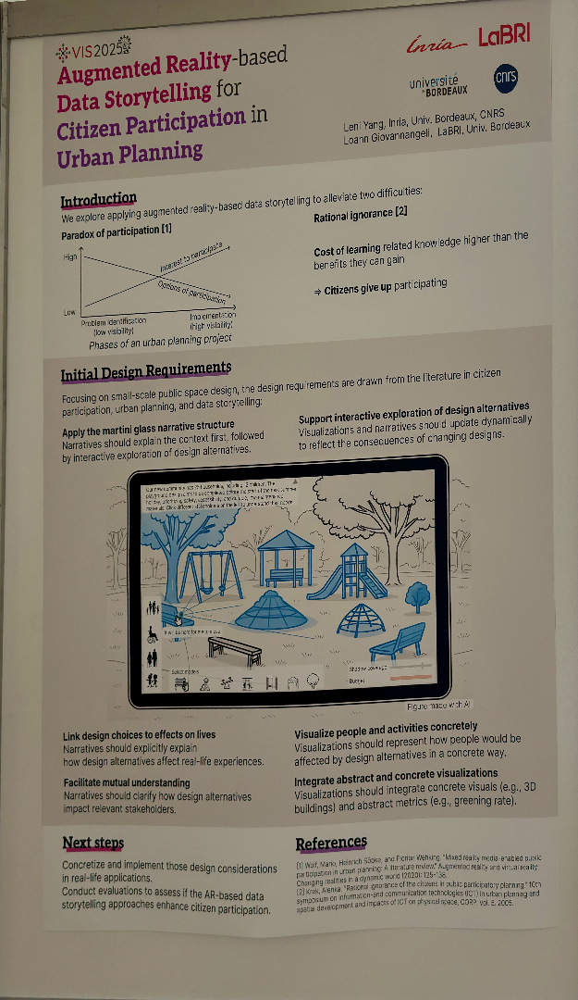
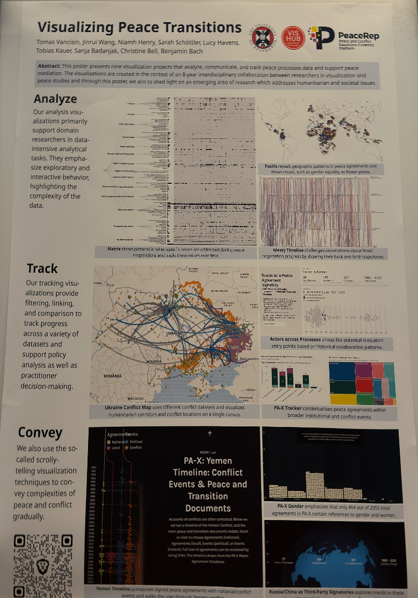
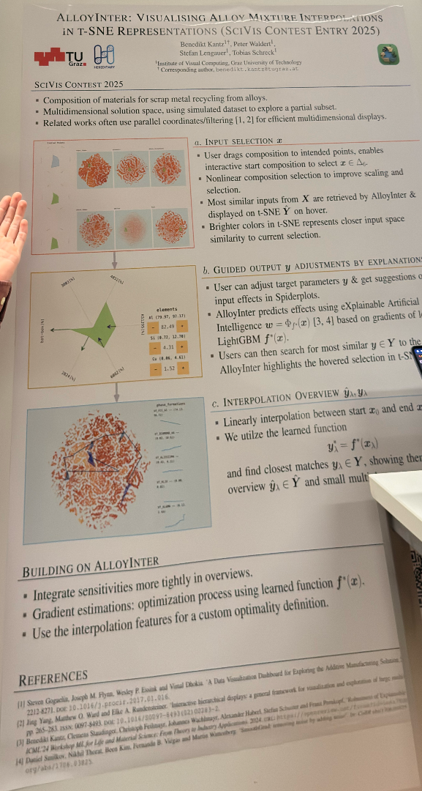
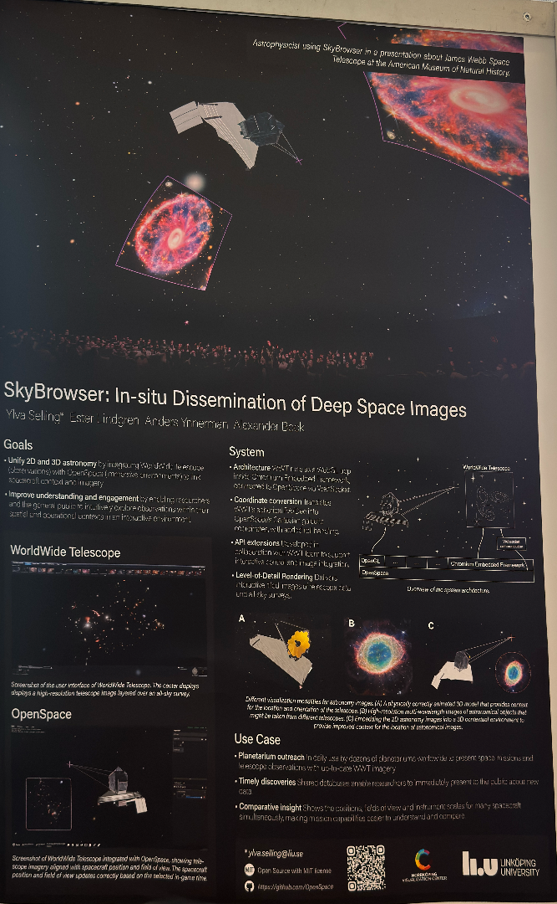
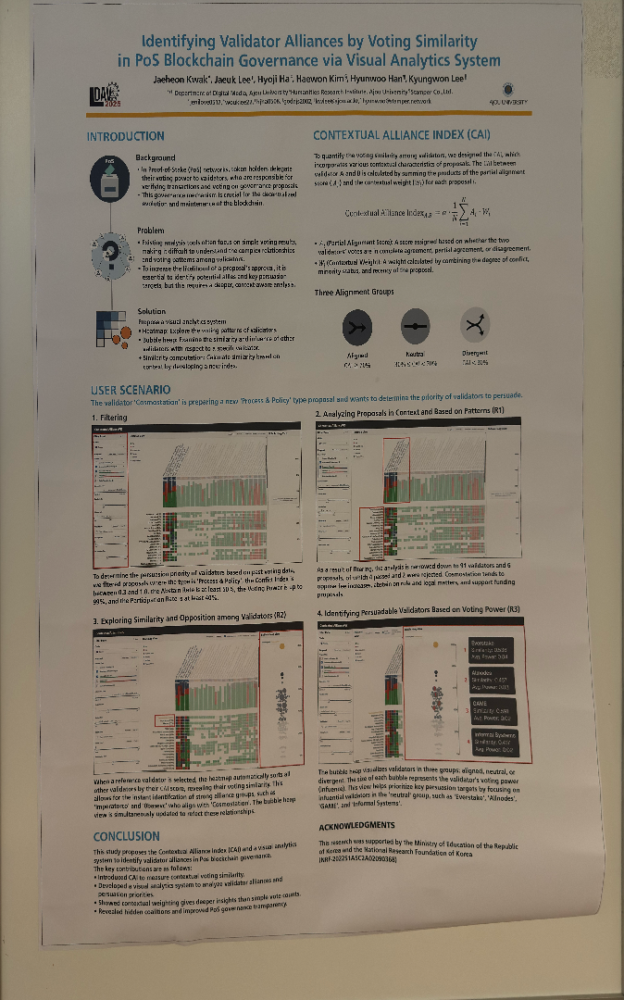

| **Poster** | **Title** | **Information** | 
| -- | -- | -- | 
|  | [ Augmented Reality-based Data Storytelling for Citizen Participation in Urban Planning ](https://ieeevis.org/year/2025/program/poster_251063e5-7f20-41b5-af14-c68722d51937.html) | *Leni Yang* | 
|  | [ Visualizing Peace Transitions: Interactive Visualizations to Support Innovation and Adaptive Management in Peace Processes ](https://ieeevis.org/year/2025/program/poster_c49e58b7-66d3-409a-b833-0b33baf4c1be.html) | *Jinrui Wang, Tomas Vancisin* | 
|  | [ AlloyInter: Visualising Alloy Mixture Interpolations in t-SNE Representations ](https://dakantz.at/papers/2025/posters/scivis_alloyinter.pdf) | *Benedikt Kantz, Stefan Lengauer, Peter Waldert and Tobias Schreck* | 
|  | [ SkyBrowser: In-situ dissemination of high-resolution deep-space images ](https://ieeevis.org/year/2025/program/poster_1e4e010c-7fc7-42da-b88d-229bf4cfcf71.html) | *Ylva Selling* | 
|  |  |  | 
