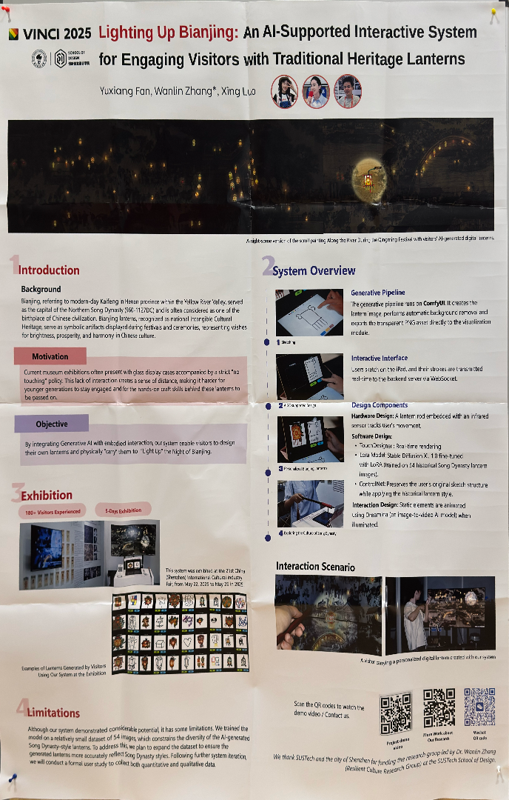
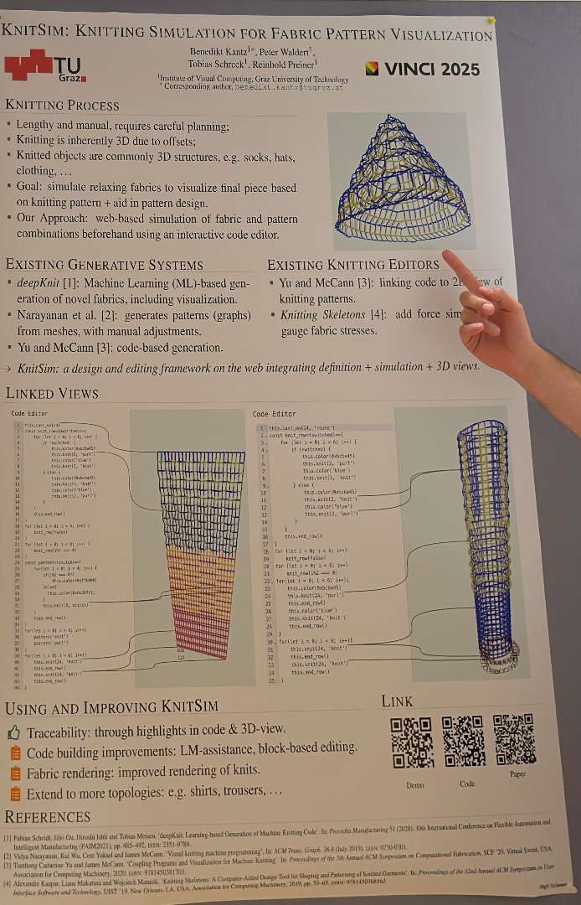
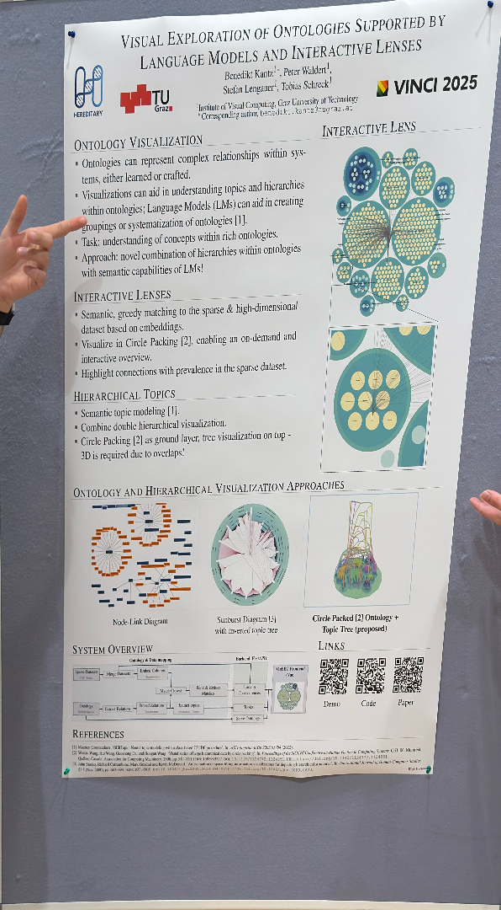
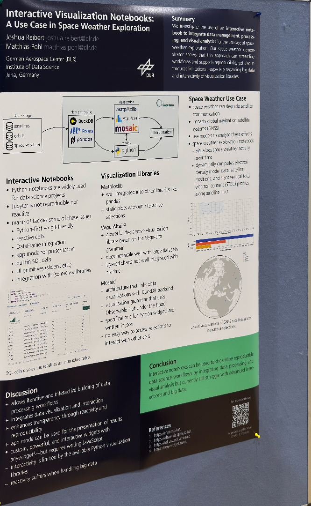
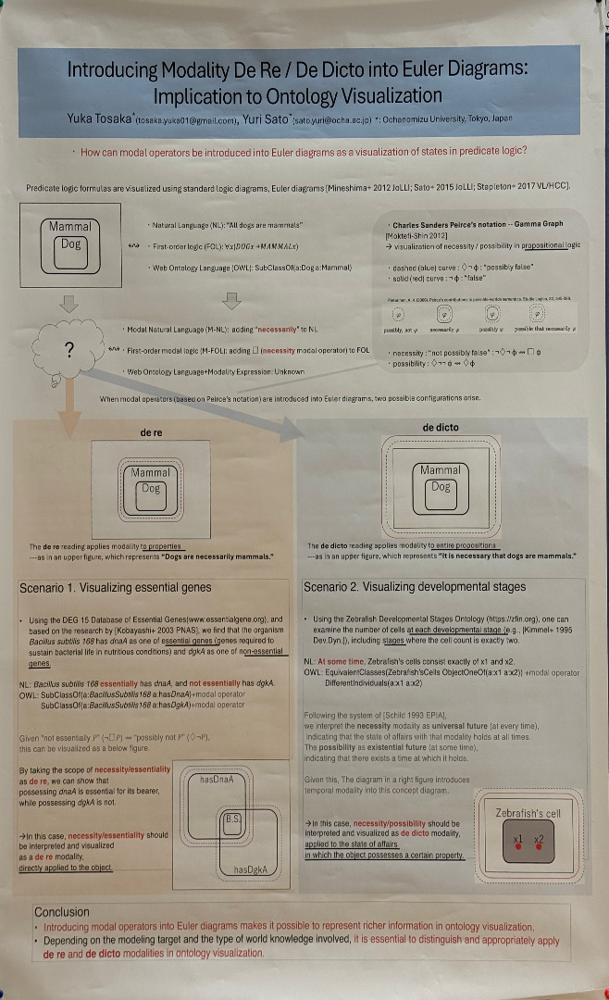

| **Poster** | **Title** | **Information** | 
| -- | -- | -- | 
|  | Lighting Up Bianjing: An AI-Supported Interactive System for Engaging Visitors with Traditional Heritage Lanterns | *Yuxiang Fan,  Wanlin Zhang, Xing Luo* | 
|  | KnitSim: Knitting Simulation for Fabric Pattern Visualization | *Benedikt Kantz,  Peter Waldert,  Tobias Schreck, Reinhold Preiner* | 
|  | Visual Exploration of Ontologies Supported by Language Models and Interactive Lenses | *Benedikt Kantz,  Peter Waldert,  Stefan Lengauer, Tobias Schreck* | 
|  | Interactive Visualization Notebooks: A Use Case in Space Weather Exploration | *Joshua Reibert, Matthias Pohl* | 
|  | Introducing Modality De Re / De Dicto into Euler Diagrams: Implication to Ontology Visualization | *Yuka Tosaka, Yuri Sato* | 
