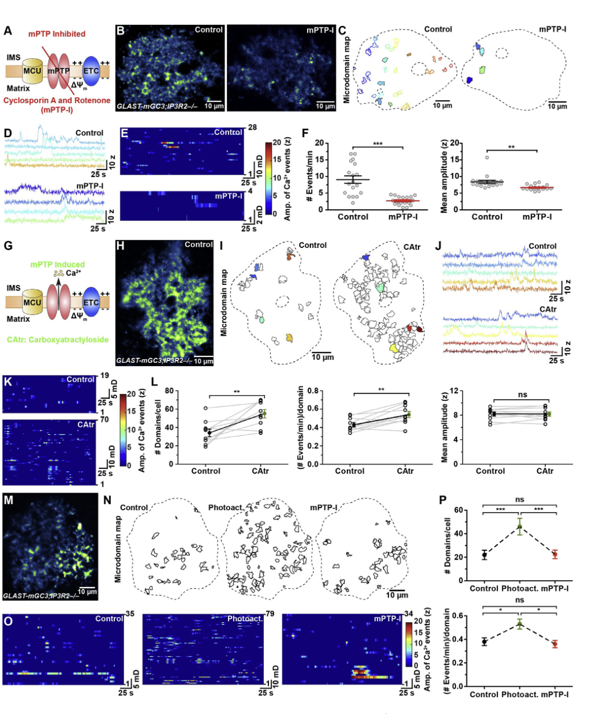
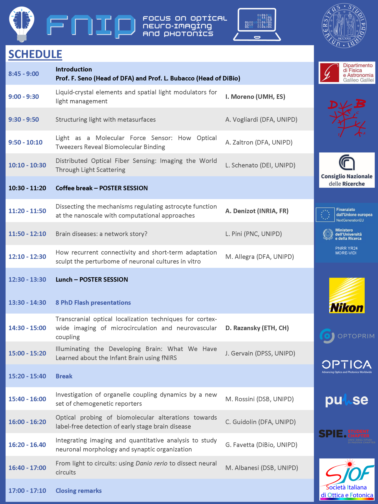

### Liquid-crystal elements and spatial light modulators for light management | 1. Moreno (UMH, ES)
- Use $\mu m$-scale LCD do attenuate phase of light, creating dynamic optical devices
- Allows creation of complex phase-shift and refractional optics

### Structuring light with metasurfaces | A. Vogliardi (DFA, UNIPD)
- Similar approach, but using silicon-based effects with sub-wavelength components

### Light as a Molecular Force Sensor: How Optical Tweezers Reveal Biomolecular Binding | A. Zaltron (DFA, UNIPD) 
- Unwrapping molecules using optical tweezers + force measurements
- Allows a force-distance-time diagram to investigate unrwrappping properties; helps to investigate structure and effects of medicine on RNA molecules

### Distributed Optical Fiber Sensing: Imaging the World Through Light Scattering | L. Schenato (DEI, UNIPD) 
- Stretch measuring through rayleigh scatttering in fibres, 
- Twist measuring through phase shifts
$\rightarrow$ enables measurements of fiber stresses in e.g. landslides, orientation in robots

### Dissecting the mechanisms regulating astrocyte function at the nanoscale with computational approaches | A. Denizot (INRIA, FR)

[Source](https://www.sciencedirect.com/science/article/pii/S0896627316310078?fr=RR-2&ref=pdf_download&rr=9de4ed461dbdbadf) 

- Very complex time-spatial data, slow processes of $Ca^{2+}$ diffusion/activities, many (millions) of complex connections; 
- Potential for time-spatial viz?, Also computational models for @Peter with *In silico* models
- More information: [A. Denizot's page](https://adenizot.github.io/) 

### Brain diseases: a network story? | L. Pini (PNC, UNIPD)
- Looking at tumors depending on connectivity region
- Take connectivity into account for neurodegenerative diseases (GIBBER?)
### How recurrent connectivity and short-term sculpt the perturbome of neuronal cultures in vitro adaptation | M. Allegra (DFA, UNIPD) 
- Neuronal structures not able to be described standard spatial -omics approaches
- Their approach: coloring through in-vitro dishes, semi-automatic annotation, ML approach for automatic annotation (?)
- Synaptic orga: quantification through visual systems

### PhD Flash talks

- ...

### Transcranial optical localization techniques for cortex-wide imaging of microcirculation and neurovascular coupling | D. Razansky (ETH, CH)
- In-vivo microscopy of blood vessels
- 200Hz flourescent imaging within subjects (e.g. full mouse brain)!
- [Website](https://www.razanskylab.org/research)
- Opto-Acoustic imaging: stimulate using ultrasound, sensing using lasers (similar to classic ultrasound)
- Also possible: volumentric capture (?)
- In combination with fMRI

### Illuminating the Developing Brain: What We Have Learned about the Infant Brain using NIRS | J. Gervain (DPSS, UNIPD)
- Assoc.: BabyLab; also a few PhD students research within that team -- interesting infant behavioral/development studies
- Take advantage of the fact that the skull is very thin - measure (relative) concentration through light intensity directly into brain
- But: ok resolution, ok resolution -- however: good acceptance, since it is relatively non-invasive/silent/mobile/.... $\rightarrow$ also athletes/pilots, coma, ...
- Study: Adults vs. Infants; compare cries vs. speech in their response -- adults respond more to speech, infants to cries! -- indicator that infants might perceive these cries as early language
- Current work: more cross-language exploration

### Optical probing of biomolecular alterations towards label-free detection of early stage brain disease | C. Guidolin (DFA, UNIPD)
- In vivo probing hard, approaches: focusing or fiber-based (using fluorescent methods)
- Do spectroscopy in mice, application: fiber-based search
- Application problem (Q): biomarker of disease, unknown! (clinical problem)

## Overview

