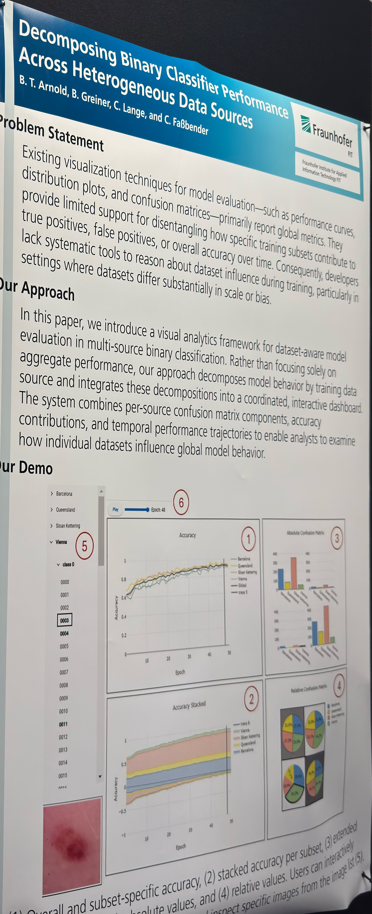
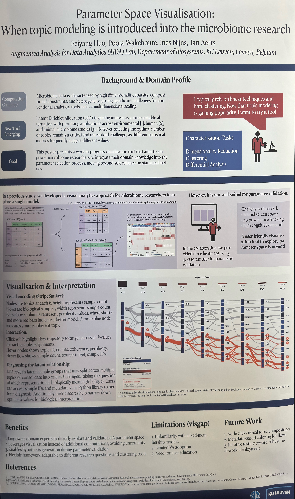
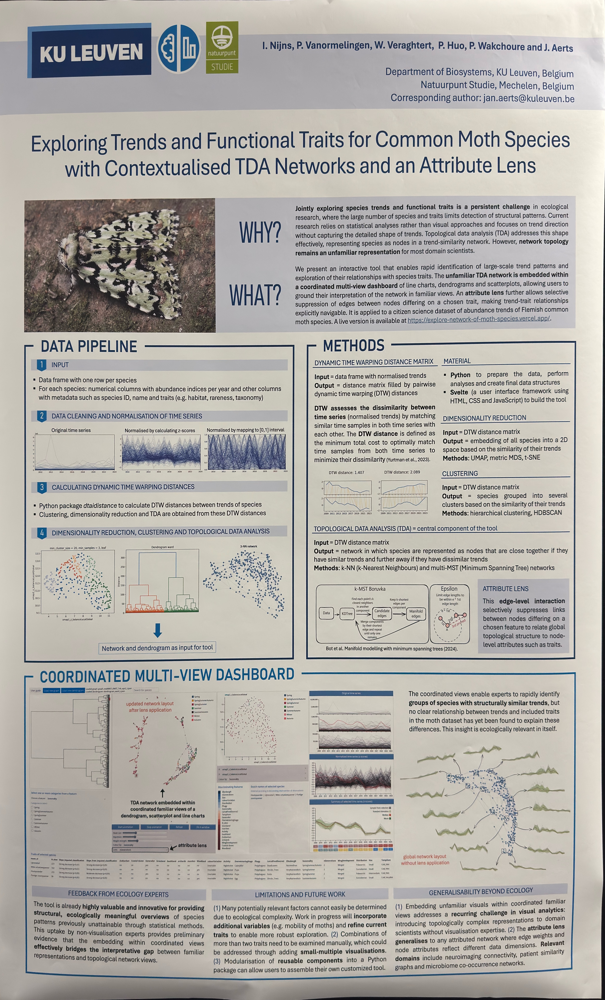

## orall and subset-specific accuracy, (2) stacked accuracy per subset, (3) extended
> Authors: B. T. Arnold, B. Greiner, C. Lange, and C. Faßbender

## When topic modeling is introduced into the microbiome research
> Authors: 3) COMER L, HUO P. COLLELUORIC. ZHAOH. AKRAM M.ZKPOSSOUR. F, SUREDA E.A., AERTS J,EVERAERT NFrom forest to farm the impact of a broad spectrum of lifestyles on the porcine gut microbiota. Current Research in Microbial Sciences (2026), 100576. 1

## Exploring Trends and Functional Traits for Common Moth Species
> Authors: I. Nijns, P. Vanormelingen, W. Veraghtert, P. Huo, P. Wakchoure and J. Aerts

